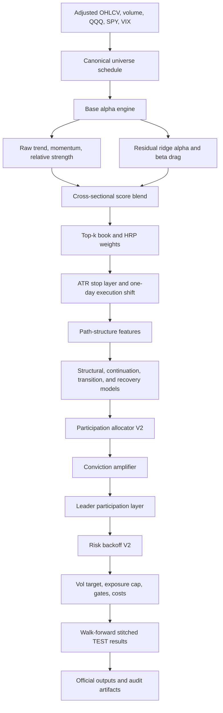
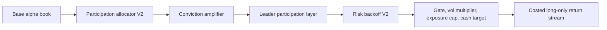

# Mahoraga

Mahoraga is a long-only equity research system for walk-forward portfolio construction, risk-aware upside participation, and post-hoc decision auditability. The repository contains one frozen official baseline, several archived research branches, an extended robustness and audit phase, a FastAPI service for reading materialized analysis outputs, and a React frontend for exploring those outputs.

The current official baseline is:

| Field | Value |
|---|---|
| Official package | `baseline/mahoraga14_3_baseline` |
| Official variant label | `MAHORAGA14_3_BASELINE_OFFICIAL` |
| Promoted research reference | `Mahoraga14_3R / ROBUST_MAIN / B1.05_C1.10_L1.10_R1.05` |
| Replaced historical control | `Mahoraga14_1_LONG_ONLY_CONTROL` |
| Candidate id | `B1.05_C1.10_L1.10_R1.05` |
| Status | Official long-only institutional baseline |
| Official role | Benchmark replacement and future long-side research anchor |
| Explicitly out of scope | Short sleeves, hedging systems, new signal discovery inside the baseline, open parameter searches inside the baseline |

The baseline is not a live trading system, broker integration, investment recommendation, or guarantee of future returns. It is a research baseline with frozen parameters, materialized outputs, audit artifacts, and documented limitations.

## Project Purpose

Mahoraga studies whether a concentrated long-only technology and growth equity portfolio can participate more effectively in strong upside regimes while reducing drawdown depth relative to passive benchmarks and an earlier long-only control.

The official baseline is built around these questions:

| Question | Implementation or audit surface |
|---|---|
| Can the strategy outperform the historical long-only control after costs? | Stitched walk-forward comparison, p/q-value tests, fold summaries |
| Can it improve on QQQ/SPY while carrying lower benchmark beta? | Newey-West alpha, beta estimates, active-return plots |
| Can upside participation be increased without disabling defense? | Participation allocator, conviction layer, leader layer, risk backoff layer |
| Is the selected candidate locally stable rather than a single fragile point? | Local stability audit, multiplier plateau, bootstrap, leave-one-window-out |
| Can decisions be audited after the fact? | Decision, position, module trace, outcome, and market-context cubes |
| Does the architecture remain coherent outside the original 12-name universe? | Extended universe robustness runs and coverage audits |

The working premise is not that one model discovers a universal market law. The premise is narrower: a frozen, inspectable long-only architecture can be evaluated as a benchmark-grade research object when its data lineage, folds, parameter choices, statistical tests, and failure modes are visible.

## Repository Map

| Path | Role |
|---|---|
| `baseline/mahoraga14_3_baseline` | Frozen official baseline package. Source, config, scripts, docs, audit files, figures, tests, manifests, and official outputs live here. |
| `research` | Archived research branches and the extended analysis phase. Research branches are not automatically official and may have intentionally missing historical artifacts. |
| `research/mahoraga14_3_extended_analysis` | Extended robustness, universe robustness, audit cubes, API, and frontend. This phase audits the frozen baseline; it does not define a new official baseline. |
| `shared` | Shared repository utilities. The active utility is `shared/pathing/repo_paths.py`, which discovers the repository layout and standard package roots. |
| `docs` | Governance and methodology documents for baseline policy, promotion rules, research policy, and institutional baseline conventions. |
| `paper` | LaTeX paper source, bibliography, and figure folder for the baseline write-up. |
| `Documentation` | Additional documentation artifact, including `Documentation/Mahoraga.pdf`. |
| `Betas` | Historical beta and prototype scripts with associated outputs. These are separate from the curated official baseline. |
| `data_cache` | Local cache area used by data-loading and backtest workflows. |
| `requirements.txt` | Root Python dependency set for the baseline research environment. |

## Official Package Layout

| Path | Contents |
|---|---|
| `baseline/mahoraga14_3_baseline/config/OFFICIAL_FREEZE.json` | Official variant label, candidate id, multiplier values, replaced baseline, and status. |
| `baseline/mahoraga14_3_baseline/config/PARAMETER_FREEZE.csv` | Frozen parameter table for the official candidate and primary/control variant keys. |
| `baseline/mahoraga14_3_baseline/src/mahoraga14_3_baseline` | Baseline source package. Contains data loading, alpha engine, path features, continuation/structural models, allocator, risk layers, runner, and reporting suite. |
| `baseline/mahoraga14_3_baseline/scripts` | User-facing scripts for running or regenerating the official baseline outputs. |
| `baseline/mahoraga14_3_baseline/outputs` | Official stitched metrics, fold summaries, alpha tests, p/q-values, priority-window scorecards, exposure/turnover/cost summaries, and figures. |
| `baseline/mahoraga14_3_baseline/audit` | Bootstrap, local stability, model-selection guard, leave-one-window-out, acceptance, continuation, leader, upside participation, and related audit files. |
| `baseline/mahoraga14_3_baseline/docs` | Baseline decision, freeze, model card, component audit, decision flow, robustness notes, overfitting risk notes, and module interface map. |
| `baseline/mahoraga14_3_baseline/manifests` | Baseline manifest metadata. |
| `baseline/mahoraga14_3_baseline/paper_pack` | Official paper-oriented export pack. |
| `baseline/mahoraga14_3_baseline/tests` | Import, path, and freeze tests. |

## Governance

The repository follows a strict separation between official baseline work and research work:

| Rule | Practical meaning |
|---|---|
| One active official baseline per main line | The official long-only baseline is `baseline/mahoraga14_3_baseline`. |
| Research begins in `research` | New hypotheses, model changes, discovery grids, and non-baseline experiments should not be introduced directly into the official baseline package. |
| Promotion requires evidence | Candidate promotion requires material improvement versus control, no material risk deterioration, priority-window acceptance, local stability, leave-one-window-out resistance, bootstrap support, and traceability. |
| Research archives can be incomplete | Archived branches document whether source snapshots or outputs are present. Missing historical outputs should be treated as missing, not silently reconstructed as official evidence. |
| The official baseline is frozen | Official files are meant to reproduce and document the promoted long-only candidate, not to reopen tuning. |

Key governance documents:

| Document | Purpose |
|---|---|
| `docs/governance/BASELINE_POLICY.md` | Defines the active-baseline convention and where official artifacts belong. |
| `docs/governance/PROMOTION_RULES.md` | Lists promotion expectations for research branches. |
| `docs/governance/RESEARCH_POLICY.md` | Documents how archived research should be interpreted. |
| `docs/methodology/INSTITUTIONAL_BASELINE.md` | Describes the official baseline as a frozen long-only institutional reference. |

## Research Lineage

Mahoraga is the result of a staged research line. Only the final baseline package is official.

| Stage | Status | Main role |
|---|---|---|
| `Betas` and early scripts | Historical prototypes | Early experiments and output artifacts. Not official evidence. |
| Mahoraga 6.1 lineage | Historical engine foundation | Walk-forward long-only engine with point-in-time-style universe scheduling, HRP allocation, ATR stop logic, vol targeting, costs, and fold validation. |
| Mahoraga 8.2 | Archived legacy concept | Hawkes-style transition urgency and Markov-lite regime fusion layered over a frozen base selector. |
| Mahoraga 9 / 9.1 | Archived legacy concept | Fragility/recovery modules, residual alpha, fast transition signals, validation utility, and multiple-testing controls. |
| Mahoraga 10 | Archived legacy concept | Alpha-first rebuild with raw directional alpha, residual alpha, managed beta penalty, and minimal adaptive policy. |
| Mahoraga 11 / 12 | Archived legacy concept | Path-structure-aware hierarchy: base alpha engine, path features, exceptional overrides, and backtest executor. |
| Mahoraga 13 | Archived legacy concept | Consolidation of base alpha, structural defense, transition/recovery, and continuation lift. |
| `research/mahoraga14_1_control` | Historical control archive | Long-only control used as the comparison anchor. The archive status says dedicated historical outputs were not preserved, although the source snapshot contains historical output files. |
| `research/mahoraga14_2` | Archived fail-fast research | First bull participation thesis with allocator and backoff. |
| `research/mahoraga14_3` | Archived promising fail-fast research | Conviction amplification and leader participation before final acceptance hardening. |
| `research/mahoraga14_3R` | Acceptance archive | Robustness, stability, and acceptance phase over the frozen 14.3 architecture. This produced the promoted candidate reference. |
| `baseline/mahoraga14_3_baseline` | Official baseline | Frozen official long-only package. |
| `research/mahoraga14_3_extended_analysis` | Current extended audit phase | Multiplier robustness, universe robustness, granular decision cubes, API, and frontend. Does not create a new baseline. |
| `research/mahoraga15A*` | Research archives | Separate short-side/allocation experiments. Not part of the official long-only baseline. |

## Official Candidate

The official candidate id is:

```text
B1.05_C1.10_L1.10_R1.05
```

The id encodes four frozen multipliers:

| Symbol | Parameter | Official value | Interpretation |
|---|---:|---:|---|
| `B` | `budget_multiplier` | `1.05` | Slightly increases the long participation budget when the allocator allows it. |
| `C` | `conviction_multiplier` | `1.10` | Increases conviction translation under healthy participation conditions. |
| `L` | `leader_multiplier` | `1.10` | Allows a conditional lift toward selected leader names when the leader layer is active. |
| `R` | `backoff_strength` | `1.05` | Slightly strengthens risk backoff under fragile conditions. |

The official architecture is frozen from `Mahoraga14_3R / ROBUST_MAIN` and documented in `baseline/mahoraga14_3_baseline/docs/BASELINE_FREEZE.md`. The official candidate is not the result of a live search inside `baseline/mahoraga14_3_baseline`; it is the accepted research candidate copied into a frozen baseline package.

## Architecture

At a high level, Mahoraga combines a concentrated long-only alpha engine with a participation allocator and layered risk controls.



### Main Source Modules

| Module | Role |
|---|---|
| `mahoraga14_config.py` | Defines the frozen baseline configuration, folds, candidate grid values, official multipliers, model switches, risk settings, and acceptance grids. |
| `mahoraga6_1.py` | Provides inherited walk-forward infrastructure, yfinance data loading, canonical universe scheduling, HRP weighting, Chandelier stop logic, costs, validation checks, and baseline backtest utilities. |
| `mahoraga14_data.py` | Loads the static official equity universe plus QQQ, SPY, and VIX; builds input frames and optional Fama-French factor data. |
| `base_alpha_engine.py` | Builds the raw/residual alpha blend, rank scores, HRP base weights, stop-adjusted weights, and one-day-shifted execution weights. |
| `path_structure_features.py` | Computes market, benchmark, breadth, drawdown, rebound, compression, exposure, turnover, stop, and path-efficiency features. |
| `transition_recovery_model.py` | Fits transition, recovery, and continuation classifiers using logistic regression and optional random-forest challengers. Includes Hawkes-style decayed stress/recovery event features. |
| `continuation_v2_model.py` | Fits continuation trigger, continuation pressure, and break-risk models used by the continuation quality layer. |
| `structural_defense_model.py` | Fits the structural defense classifier used by exceptional defense logic. |
| `participation_allocator_v2.py` | Converts regime evidence into long budget, gate scale, vol multiplier, exposure cap, cash target, leader blend, and allocator state. |
| `conviction_amplifier_layer.py` | Conditionally amplifies participation when continuation, benchmark, fragility, break-risk, and structural constraints are acceptable. |
| `leader_participation_layer.py` | Blends toward leader-aware weights and applies conditional leader tilts while respecting budget and per-name constraints. |
| `risk_backoff_layer_v2.py` | Reduces participation when break risk, fragility, benchmark weakness, structural probability, or breadth deterioration breach soft or hard guards. |
| `override_policy.py` | Applies structural defense and continuation-lift policy logic before final execution. |
| `backtest_executor.py` | Runs fold-by-fold walk-forward evaluation, model fitting, validation selection, official variant construction, benchmark stitching, and output payload creation. |
| `official_baseline_runner.py` | Loads official inputs, executes the official walk-forward run, and delegates output writing. |
| `official_baseline_suite.py` | Saves official CSVs, figures, audit files, docs, manifests, and paper-pack outputs. |
| `mahoraga14_utils.py` | Provides utility functions for q-values, paired tests, cross-sectional z-scores, sigmoid transforms, and grid handling. |

### Data Pipeline

The baseline uses adjusted market data obtained through `yfinance`:

| Element | Detail |
|---|---|
| Price adjustment | `yf.download(..., auto_adjust=True)` is used in the inherited data loader. |
| Data start | `2005-01-01` in the inherited config. |
| Official output end | `2026-02-20` in the frozen baseline artifacts. |
| Missing values | Forward-fill limit of 5 observations in the inherited loader. |
| Benchmarks | `QQQ`, `SPY`, and `^VIX`. |
| Static official equities | `AAPL`, `MSFT`, `NVDA`, `GOOGL`, `AMZN`, `META`, `AVGO`, `ASML`, `TSM`, `ADBE`, `NFLX`, `AMD`. |
| Universe process | Quarterly canonical schedule with liquidity/size proxies, seasoning, retention buffers, and a static fallback universe. |
| Cache behavior | Data and walk-forward artifacts may be cached locally under `data_cache` or branch-specific output caches. |

The code applies several look-ahead controls:

- Alpha features are shifted before execution.
- Final execution weights are shifted one trading day.
- Gate and scale values are also shifted before realized returns are computed.
- Walk-forward folds have explicit training, validation, embargo, and test boundaries.
- `validate_no_lookahead` checks expected shift behavior in the inherited backtest code.

These controls reduce obvious look-ahead leakage, but they do not turn vendor data into a fully institutional point-in-time security master. The yfinance source and static universe design leave residual data-quality and survivorship limitations.

### Alpha Engine

The base alpha engine combines:

| Signal family | Description |
|---|---|
| Raw trend | Price trend and moving-average slope features. |
| Momentum | Multi-window absolute and relative momentum features. |
| Relative strength | Strength versus benchmark context, primarily QQQ. |
| Residual alpha | Ridge residualization against QQQ, SPY, a technology basket, and a first principal component proxy. |
| Beta drag | Penalty for unfavorable benchmark beta exposure in weak contexts. |
| Cross-sectional ranking | Z-scored signals are blended into a daily rank score. |
| HRP allocation | Selected names are weighted using hierarchical risk-parity-style allocation with Ledoit-Wolf covariance estimation and inverse-volatility fallback behavior. |

The official baseline uses a concentrated long-only book:

| Parameter | Official/inherited setting |
|---|---:|
| `top_k` | `3` |
| Per-name weight cap | `0.60` |
| Volatility target | `0.30` |
| Chandelier ATR window | `14` |
| Official Chandelier ATR multiplier | `3.0` |
| Rebalance frequency | Weekly, Friday (`W-FRI`) |
| Commission assumption | `0.0010` |
| Slippage assumption | `0.0003` |
| QQQ expense assumption | `0.0020 / 252` |

### Machine Learning Layer

Machine learning is used as a supporting regime and policy layer, not as an end-to-end black-box trading model.

| Model family | Implementation |
|---|---|
| Structural defense | Predicts when structural defense logic should matter. |
| Continuation trigger | Predicts whether a constructive continuation setup is active. |
| Continuation pressure | Estimates pressure for further upside participation. |
| Break risk | Estimates deterioration risk that can block or reduce participation. |
| Transition/recovery | Uses path features and Hawkes-style decayed stress/recovery event intensities. |

The implementation uses logistic regression with scaling and class balancing, plus optional random-forest challengers. Validation AUC is used to select between logistic and challenger models where enabled. These models provide probabilities and context scores consumed by deterministic allocator and risk logic.

The Hawkes-inspired features are decayed event-intensity summaries. The repository does not implement a full continuous-time Hawkes process estimation layer, and it does not implement continuous fluid equations. The physics-inspired language in older research should be read as feature-engineering intuition, not as a claim that physical laws are being solved.

### Allocation and Risk Stack

The official stack is:



| Layer | What it can do | What it cannot do |
|---|---|---|
| Participation allocator V2 | Adjust long budget, gate scale, vol multiplier, exposure cap, cash target, leader blend, and participation state. | It does not create shorts or hedges. |
| Conviction amplifier | Increase participation when continuation, benchmark, fragility, break-risk, and structural constraints are acceptable. | It does not bypass risk controls. |
| Leader participation layer | Tilt toward selected leaders when conditions support leader participation. | It does not permanently concentrate the book in one name or disable budget limits. |
| Risk backoff V2 | Reduce budget, gate, vol multiplier, exposure cap, and leader/conviction effects under fragile conditions. | It does not guarantee drawdown avoidance. |
| ATR stop layer | Converts stopped weights to cash under the configured stop behavior and permits re-entry. | It is not a complete execution or order-management system. |

The audit cube's representative candidate subset recorded zero stop activations in `stop_loss_audit.csv`. The stop module is part of the engine, but that specific audit slice should not be read as evidence of frequent stop-driven behavior.

## Walk-Forward Design

The official stitched out-of-sample results are built from five test folds:

| Fold | Test start | Test end | Broad market context |
|---:|---|---|---|
| 1 | `2017-01-03` | `2018-12-31` | Expansion period ending with a material growth drawdown. |
| 2 | `2019-01-02` | `2020-12-31` | Strong growth market with the 2020 crash and rebound. |
| 3 | `2021-01-04` | `2022-12-30` | Rate-driven growth drawdown and benchmark stress. |
| 4 | `2023-01-03` | `2024-06-28` | Strong large-cap technology and AI-led upside regime. |
| 5 | `2024-07-01` | `2026-02-20` | Recent out-of-sample segment in the frozen artifacts. |

The walk-forward design uses training and validation windows before each test window. The stitched official comparison uses only the TEST slices from the folds. As noted in the inherited fold builder, later validation can reuse earlier out-of-sample history in an expanding research workflow; the stitched TEST series is therefore the official reporting object, not a single untouched future-period experiment.

## Statistical and Audit Methods

The repository reports multiple types of evidence instead of relying on one metric.

| Method | Meaning |
|---|---|
| CAGR | Annualized compound return for the stitched or fold-level series. |
| Sharpe | Annualized mean excess return divided by volatility, using the implementation's daily-return convention. |
| Sortino | Downside-risk-adjusted return metric. |
| MaxDD | Maximum drawdown. Reported as a negative percentage in output tables. |
| Beta to QQQ/SPY | Regression beta against the benchmark return stream. |
| Newey-West alpha | Annualized regression intercept with Newey-West standard errors for serial-correlation-robust inference. |
| p-values | Pairwise or model-selection test evidence produced by the official reporting suite. |
| q-values | Multiple-testing-adjusted p-values using the repository's q-value logic, including Benjamini-Yekutieli style controls in validation utilities. |
| Stationary block bootstrap | Resampling diagnostic used for robustness distribution summaries. |
| Local stability | Tests whether the selected candidate sits in a robust parameter neighborhood rather than at an isolated point. |
| Leave-one-window-out | Repeats selection diagnostics while excluding priority windows. |
| Cost and slippage stress | Recomputes official metrics under higher transaction-cost or slippage assumptions. |
| Priority-window acceptance | Checks behavior in important upside windows, especially versus the historical control. |
| Audit cubes | Date-level, position-level, module-level, outcome-level, and market-context materializations for inspection. |

Extended analysis adds:

| Extended metric | Meaning |
|---|---|
| `distance_to_decay` | Minimum max relative perturbation where a sampled candidate breaches a decay condition: Sharpe drop over 10%, CAGR drop over 10%, MaxDD worsening over 5 percentage points, or severe fold damage. |
| `robust_region_share_extended` | Share of sampled multiplier candidates that pass the extended robustness checks. |
| Plateau radius | Per-axis sampled interval around the official value that remains robust while other multipliers stay fixed. |
| Sensitivity score | Aggregate damage score for an axis under sampled perturbations. |
| Severe fold damage count | Count of fold-level damage events under extended robustness definitions. |

These diagnostics support baseline selection and interpretation. They do not prove that the strategy is globally optimal or future-proof.

## Official Stitched Results

Official stitched comparison from `baseline/mahoraga14_3_baseline/outputs/stitched_comparison_official.csv`:

| Series | CAGR | Sharpe | Sortino | MaxDD | Beta QQQ | Beta SPY | Alpha NW vs QQQ |
|---|---:|---:|---:|---:|---:|---:|---:|
| `QQQ` | 20.14% | 0.918 | 1.456 | -35.24% | 1.000 | 1.160 | 0.000 |
| `SPY` | 14.88% | 0.846 | 1.309 | -33.72% | 0.752 | 1.000 | -0.002 |
| `MAHORAGA14_1_LONG_ONLY_CONTROL` | 24.68% | 1.194 | 2.006 | -20.24% | 0.485 | 0.468 | 0.149 |
| `MAHORAGA14_3_BASELINE_OFFICIAL` | 32.55% | 1.483 | 2.528 | -16.20% | 0.516 | 0.508 | 0.215 |

The official baseline improves stitched CAGR, Sharpe, Sortino, and MaxDD versus the historical long-only control in the frozen output set. It also reports lower maximum drawdown than QQQ and SPY while maintaining positive Newey-West alpha versus QQQ.

## Fold Results

Official fold summary from `baseline/mahoraga14_3_baseline/outputs/fold_summary_official.csv`:

| Fold | Official CAGR | Official Sharpe | Official MaxDD | Control CAGR | Control Sharpe | QQQ CAGR | QQQ Sharpe |
|---:|---:|---:|---:|---:|---:|---:|---:|
| 1 | 13.77% | 0.829 | -13.71% | 10.55% | 0.710 | 14.94% | 0.873 |
| 2 | 46.53% | 1.815 | -16.20% | 27.43% | 1.316 | 43.22% | 1.438 |
| 3 | 13.40% | 0.799 | -13.10% | 11.66% | 0.680 | -7.51% | -0.168 |
| 4 | 107.51% | 2.969 | -11.57% | 98.05% | 2.651 | 49.24% | 2.437 |
| 5 | 13.70% | 0.782 | -14.45% | 5.62% | 0.382 | 15.54% | 0.764 |

The official candidate beats the historical control in all five fold-level CAGRs in the frozen summary. QQQ still outperforms official CAGR in fold 1 and fold 5, which is an important limitation when interpreting the strategy as a benchmark replacement rather than a uniformly superior return stream.

## Alpha and Significance Results

Newey-West alpha table from `baseline/mahoraga14_3_baseline/outputs/alpha_nw_official.csv`:

| Series | Benchmark | Alpha annualized | t-stat | p-value | Beta | R2 |
|---|---|---:|---:|---:|---:|---:|
| Control | QQQ | 0.149 | 2.490 | 0.0128 | 0.485 | 0.302 |
| Control | SPY | 0.183 | 2.716 | 0.0066 | 0.468 | 0.189 |
| Official | QQQ | 0.215 | 3.613 | 0.0003 | 0.516 | 0.333 |
| Official | SPY | 0.251 | 3.739 | 0.0002 | 0.508 | 0.209 |

Pairwise p/q-value table from `baseline/mahoraga14_3_baseline/outputs/pvalue_qvalue_official.csv`:

| Comparison | p-value | q-value | CAGR delta | Sharpe delta | Sortino delta | MaxDD delta |
|---|---:|---:|---:|---:|---:|---:|
| Official vs Control | 0.0032 | 0.0174 | 7.87 | 0.289 | 0.522 | 4.04 |
| Official vs QQQ | 0.0804 | 0.1473 | 12.41 | 0.565 | 1.072 | 19.04 |
| Official vs SPY | 0.0144 | 0.0397 | 17.67 | 0.636 | 1.219 | 17.52 |

The q-value evidence is strongest versus the historical control and SPY in the official table. The official-vs-QQQ row has a larger q-value and should be read more cautiously.

## Priority Windows

Priority-window return table from `baseline/mahoraga14_3_baseline/outputs/priority_window_acceptance_official.csv`:

| Window | Official return | Control return | QQQ return | SPY return |
|---|---:|---:|---:|---:|
| `2017_2018` | 29.30% | 22.13% | 31.97% | 16.14% |
| `2020_2021` | 90.74% | 68.81% | 109.97% | 89.10% |
| `2023_2024` | 207.17% | 174.80% | 93.69% | 57.58% |

The acceptance decision marks the priority windows as passing in `baseline/mahoraga14_3_baseline/audit/acceptance_decision_official.md`. The raw window-return table also shows that QQQ outperformed the official candidate in `2017_2018` and `2020_2021`. That nuance matters: the baseline is stronger versus the historical control and in drawdown-adjusted stitched behavior than in every raw upside benchmark window.

## Exposure, Turnover, and Cost Stress

Exposure summary from `baseline/mahoraga14_3_baseline/outputs/exposure_summary_official.csv`:

| Series | Mean exposure | Median exposure | p05 | p95 | Max |
|---|---:|---:|---:|---:|---:|
| Control | 0.632 | 0.778 | 0.000 | 1.000 | 1.000 |
| Official | 0.653 | 0.915 | 0.000 | 0.972 | 1.008 |

Turnover summary from `baseline/mahoraga14_3_baseline/outputs/turnover_summary_official.csv`:

| Series | Mean turnover | Median turnover | p95 | Max |
|---|---:|---:|---:|---:|
| Control | 0.0345 | 0.0005 | 0.264 | 0.781 |
| Official | 0.0497 | 0.0008 | 0.341 | 0.867 |

Return per exposure from `baseline/mahoraga14_3_baseline/outputs/return_per_exposure_official.csv`:

| Series | Return per exposure | Total return | Average exposure | Observations |
|---|---:|---:|---:|---:|
| Control | 0.001514 | 6.457 | 0.632 | 2295 |
| Official | 0.001838 | 12.019 | 0.653 | 2295 |

Cost and slippage stress from `baseline/mahoraga14_3_baseline/outputs/cost_sensitivity_official.csv`:

| Scenario | CAGR | Sharpe | MaxDD |
|---|---:|---:|---:|
| Baseline cost | 32.55% | 1.483 | -16.20% |
| Cost plus 25 | 32.02% | 1.463 | -16.31% |
| Cost plus 50 | 31.48% | 1.443 | -16.41% |
| Cost plus 100 | 30.42% | 1.404 | -16.63% |
| Slippage plus 5 bps | 31.73% | 1.452 | -16.36% |

The official candidate is more active than the historical control. Its reported cost-stress degradation is contained in the official artifacts, but the execution assumptions remain simplified relative to a production order-management system.

## Baseline Robustness Audits

Selected official audit outputs:

| Audit | Result |
|---|---|
| Bootstrap summary | Candidate CAGR p50 `0.3177`, mean `0.3252`, p05 `0.2080`; candidate Sharpe p50 `1.4691`, p05 `1.0349`; delta Sharpe p50 `0.2903`. |
| Local stability | Official candidate robust score `0.9951`, robust flag `1`, local rank `1`, plateau share `50.62%`. |
| Model-selection guard | Local family reality-check p-value `0.0000`; official centered bootstrap p-value `0.0000`; interpreted as best robust point in the accepted local plateau, not a global optimum proof. |
| Leave-one-window-out | Official candidate selected in every exclusion experiment. Excluding `2017_2018` and `2020_2021` still shows negative deltas versus QQQ for those windows but positive deltas versus control. |
| Continuation diagnostic | Stitched activations `10`, activation rate `0.0368`, 4-week hit rate `0.5833`, no-activation 4-week hit rate `0.5563`. |
| Acceptance decision | Priority windows `2017_2018`, `2020_2021`, and `2023_2024` recorded as `PASS`; gate role `ROBUST_MAIN`. |

## Extended Analysis

`research/mahoraga14_3_extended_analysis` audits the frozen official baseline without redefining it. Its stated objective is extended multiplier robustness, universe dependence, and granular decision traceability.

Main commands:

```powershell
python .\research\mahoraga14_3_extended_analysis\run_extended_analysis.py
python .\research\mahoraga14_3_extended_analysis\run_extended_analysis.py --force
python .\research\mahoraga14_3_extended_analysis\run_extended_analysis.py --skip-universes
python .\research\mahoraga14_3_extended_analysis\run_extended_analysis.py --max-new-universe-runs 0
```

The final extended report is `research/mahoraga14_3_extended_analysis/outputs/reports/final_extended_analysis_report.md`.

### Extended Multiplier Robustness

Extended summary for the official candidate:

| Metric | Value |
|---|---:|
| Official CAGR | 32.55% |
| Official Sharpe | 1.483 |
| Official Sortino | 2.528 |
| Official MaxDD | -16.20% |
| Sampled multiplier candidates | 42 |
| `distance_to_decay` | 0.0476 |
| `robust_region_share_extended` | 64.29% |

Sensitivity ranking:

| Axis | Sensitivity score | Worst sampled candidate | Worst Sharpe drop | Worst CAGR drop | Worst MaxDD worsening | Severe fold damage count |
|---|---:|---|---:|---:|---:|---:|
| Budget | 5.567 | `B0.90_C1.10_L1.10_R1.05` | 0.190 | 0.294 | 0.415 | 5 |
| Leader | 0.178 | `B1.05_C1.10_L0.90_R1.05` | 0.050 | 0.074 | 0.267 | 0 |
| Backoff | 0.150 | `B1.05_C1.10_L1.10_R0.90` | 0.029 | 0.019 | 0.512 | 0 |
| Conviction | 0.076 | `B1.05_C0.90_L1.10_R1.05` | 0.029 | 0.045 | 0.006 | 0 |

Plateau report:

| Axis | Official value | Robust min | Robust max | Relative plateau radius |
|---|---:|---:|---:|---:|
| Budget | 1.05 | 1.05 | 1.15 | 0.000 |
| Conviction | 1.10 | 0.90 | 1.30 | 0.182 |
| Leader | 1.10 | 0.90 | 1.30 | 0.182 |
| Backoff | 1.05 | 0.90 | 1.20 | 0.143 |

The strongest extended sensitivity is budget underdeployment. The official point is more tolerant to sampled conviction, leader, and backoff perturbations than to reducing the budget multiplier.

### Universe Robustness

Official-candidate universe results from the extended report:

| Universe | Usable count | CAGR | Sharpe | Sortino | MaxDD | Alpha NW vs QQQ | Status |
|---|---:|---:|---:|---:|---:|---:|---|
| `base_universe_12` | 12 | 32.55% | 1.483 | 2.528 | -16.20% | 0.215 | OK |
| `tech_20` | 20 | 29.96% | 1.381 | 2.380 | -19.48% | 0.191 | OK |
| `tech_plus_semis` | 23 | 30.92% | 1.372 | 2.327 | -19.69% | 0.200 | OK |
| `wider_largecap_growth` | 24 | 24.93% | 1.203 | 2.054 | -21.17% | 0.154 | OK |
| `negative_control_nontech` | 16 | n/a | n/a | n/a | n/a | n/a | Aborted by compute budget after coverage audit |

The negative non-technology universe had full coverage in the coverage audit but no completed walk-forward metrics in the recorded extended run. It should not be used to claim cross-sector robustness.

### Audit Cubes

The extended analysis materializes granular cubes under `research/mahoraga14_3_extended_analysis/outputs/audit_cube`.

| File | Rows | Purpose |
|---|---:|---|
| `decision_date_cube.parquet` | 13,770 | One row per date/fold/candidate/universe with allocator state, participation controls, continuation/backoff/leader signals, exposure, turnover, and override state. |
| `position_cube.parquet` | 165,240 | One row per date/ticker/fold/candidate/universe with scores, ranks, selected flag, weights, stop flag, forward returns, and PnL contribution. |
| `module_trace_cube.parquet` | 96,390 | One row per date/module/candidate/fold/universe with branch, threshold, signal strength, input/output JSON summaries, and reason codes. |
| `outcome_cube.parquet` | 41,310 | One row per decision date/horizon/candidate/fold/universe with realized returns, benchmark alpha, exposure, turnover, drawdown change, and helped flags. |
| `market_context_cube.parquet` | 2,295 | One row per date with benchmark returns, drawdowns, volatility, breadth, benchmark strength/weakness, and market-regime proxy fields. |

Representative candidates in the full cubes are limited to:

```text
B1.05_C1.10_L1.10_R1.05
EXTREME_pro-risk
EXTREME_pro-defense
B0.90_C1.10_L1.10_R1.05
B1.05_C1.10_L0.90_R1.05
B1.05_C0.90_L1.10_R1.05
```

Small audit CSVs summarize specific module behavior:

| File | Notable official result |
|---|---|
| `backoff_audit.csv` | Official backoff helped rates: 1-day `0.507`, 5-day `0.524`, 20-day `0.559`. |
| `continuation_activation_audit.csv` | Official continuation helped rates: 1-day `0.492`, 5-day `0.566`, 20-day `0.643`. |
| `leader_participation_audit.csv` | Official leader helped rates: 1-day `0.492`, 5-day `0.559`, 20-day `0.633`. |
| `structural_defense_audit.csv` | Official defense-blend count `444`, average signal `0.390`. |
| `stop_loss_audit.csv` | Total stop count `0` for each representative candidate in this audit subset. |

Example cube usage:

```python
from pathlib import Path
import pandas as pd

cube_root = Path("research/mahoraga14_3_extended_analysis/outputs/audit_cube")

decisions = pd.read_parquet(cube_root / "decision_date_cube.parquet")
positions = pd.read_parquet(cube_root / "position_cube.parquet")
outcomes = pd.read_parquet(cube_root / "outcome_cube.parquet")

official_decisions = decisions[
    decisions["candidate_id"].eq("B1.05_C1.10_L1.10_R1.05")
]

selected_nvda = positions[
    positions["ticker"].eq("NVDA") & positions["selected_flag"].eq(1)
]

hard_backoffs = official_decisions[
    official_decisions["hard_backoff_flag"].eq(1)
]
```

## API

The extended-analysis API serves materialized CSV and Parquet outputs. It does not recompute the strategy.

Start the API:

```powershell
python .\research\mahoraga14_3_extended_analysis\run_api.py
```

`run_api.py` binds to `127.0.0.1` and scans ports `8000` through `8019`, using the first available port.

Main endpoints:

| Endpoint | Purpose |
|---|---|
| `GET /health` | Health check and output availability. |
| `GET /summary/baseline` | Official summary, robust share, universe run count, and figure paths. |
| `GET /robustness/multipliers` | Extended multiplier robustness table. |
| `GET /robustness/plateau` | Plateau and sensitivity summaries. |
| `GET /decisions` | Filtered decision-date cube records. |
| `GET /positions` | Filtered position cube records. |
| `GET /module-trace` | Filtered module trace records. |
| `GET /market-context` | Filtered market-context records. |
| `GET /universes/summary` | Universe robustness summary. |
| `GET /figures/...` | Static figure serving. |

Large cube endpoints support filters such as `date_start`, `date_end`, `fold`, `candidate_id`, `universe_id`, and `limit`. `positions` also supports `ticker` and `selected_only`; `module-trace` also supports `module_name`. The API caps record limits to protect interactive usage.

Example:

```powershell
Invoke-RestMethod "http://127.0.0.1:8000/health"
Invoke-RestMethod "http://127.0.0.1:8000/positions?ticker=NVDA&selected_only=true&limit=50"
```

If the API starts on a different port, use that port in the URL.

## Frontend

The frontend is a React/TypeScript interface for the extended-analysis outputs.

Start it:

```powershell
cd .\research\mahoraga14_3_extended_analysis\frontend
npm install
npm run dev
```

By default the frontend expects the API at `http://127.0.0.1:8000`. If the API starts on another port:

```powershell
$env:VITE_API_BASE="http://127.0.0.1:8001"
npm run dev
```

Frontend views:

| View | Purpose |
|---|---|
| Baseline Overview | Official metrics, robustness summary, universe snapshot, and figures. |
| Multiplier Robustness | Candidate table, filters, plateau summary, sensitivity ranking, and robustness figures. |
| Decision Audit Explorer | Decision, position, module-trace, and market-context cube exploration. |

Frontend package details:

| Item | Value |
|---|---|
| Framework | React `19.1.1` with Vite `7.1.9` |
| Language | TypeScript `5.9.3` |
| Icons | `lucide-react` |
| Styling | Tailwind CSS |
| Scripts | `npm run dev`, `npm run build`, `npm run preview` |

## Installation

Recommended local setup on Windows PowerShell:

```powershell
cd D:\QuantMahoraga
python -m venv .venv
.\.venv\Scripts\Activate.ps1
python -m pip install --upgrade pip
pip install -r requirements.txt
```

For extended analysis, API, and audit-cube Parquet support:

```powershell
pip install -r .\research\mahoraga14_3_extended_analysis\requirements_extended.txt
```

`requirements_extended.txt` installs the root requirements plus:

```text
fastapi==0.118.0
uvicorn==0.37.0
pyarrow==21.0.0
```

For the frontend, install a current Node.js runtime that satisfies Vite 7, then run the frontend commands shown above.

## Running the Official Baseline

Run the frozen official baseline:

```powershell
python .\baseline\mahoraga14_3_baseline\scripts\run_official_baseline.py
```

Regenerate official outputs:

```powershell
python .\baseline\mahoraga14_3_baseline\scripts\regenerate_official_outputs.py
```

Both scripts bootstrap the package paths, create the official config, load official inputs, execute the walk-forward baseline, and save official outputs through `official_baseline_suite.py`.

The run may need network access for yfinance data unless all necessary cache artifacts are already present.

## Running Tests

Baseline tests are located under:

```text
baseline/mahoraga14_3_baseline/tests
```

If `pytest` is installed in the environment:

```powershell
python -m pytest .\baseline\mahoraga14_3_baseline\tests
```

The visible tests cover import/path behavior and freeze metadata. They are useful smoke checks, not a full statistical-regression test suite.

## Output Inventory

Important official output files:

| File | Contents |
|---|---|
| `outputs/stitched_comparison_official.csv` | Stitched official, control, QQQ, and SPY performance comparison. |
| `outputs/fold_summary_official.csv` | Fold-level metrics. |
| `outputs/alpha_nw_official.csv` | Newey-West alpha and beta regressions. |
| `outputs/pvalue_qvalue_official.csv` | Pairwise statistical comparison table. |
| `outputs/priority_window_acceptance_official.csv` | Priority-window return table. |
| `outputs/bull_window_scorecard_official.csv` | Bull-window scorecard. |
| `outputs/exposure_summary_official.csv` | Exposure distribution summary. |
| `outputs/turnover_summary_official.csv` | Turnover distribution summary. |
| `outputs/return_per_exposure_official.csv` | Return per unit of average exposure. |
| `outputs/cost_sensitivity_official.csv` | Cost and slippage stress results. |

Important official figures:

| File | Contents |
|---|---|
| `outputs/equity_curve_official.png` | Official stitched equity curve comparison. |
| `outputs/active_return_vs_qqq_official.png` | Active return versus QQQ. |
| `outputs/fold_heatmap_official.png` | Fold metric heatmap. |
| `outputs/bull_window_scorecard_official.png` | Bull-window visualization. |
| `outputs/local_stability_heatmap_official.png` | Local stability visualization. |
| `outputs/robustness_distribution_official.png` | Bootstrap/robustness distribution visualization. |

Important official audit files:

| File | Contents |
|---|---|
| `audit/bootstrap_summary_official.csv` | Bootstrap distribution summaries. |
| `audit/local_stability_summary_official.md` | Local stability result and plateau share. |
| `audit/model_selection_guard_official.md` | Reality-check-style model-selection guard. |
| `audit/leave_one_window_out_summary_official.md` | Leave-one-window-out acceptance diagnostics. |
| `audit/acceptance_decision_official.md` | Promotion acceptance summary. |
| `audit/continuation_diagnostic_official.csv` | Continuation activation diagnostic. |
| `audit/upside_participation_decomposition_official.csv` | Upside participation decomposition by priority window. |
| `audit/leader_miss_analysis_official.csv` | Leader participation and missed-leader analysis. |

Important extended output files:

| File | Contents |
|---|---|
| `outputs/reports/final_extended_analysis_report.md` | Final extended robustness and universe-dependence report. |
| `outputs/reports/implementation_report.md` | Implementation, timing, verification, and limitation report. |
| `outputs/extended_multiplier_robustness/extended_multiplier_summary.csv` | Candidate-level multiplier robustness summary. |
| `outputs/extended_multiplier_robustness/plateau_radius_report.md` | Plateau definitions and per-axis results. |
| `outputs/universe_robustness/universe_coverage_audit.csv` | Universe ticker coverage audit. |
| `outputs/audit_cube/cube_dictionary.md` | Cube definitions, lineage, and limitations. |
| `outputs/audit_cube/cube_lineage.md` | Source and transformation lineage for cubes. |

## Paper

The paper source lives in `paper`:

| File | Purpose |
|---|---|
| `paper/mahoraga_baseline_paper.tex` | LaTeX source for the baseline paper. |
| `paper/references.bib` | Bibliography, including internal project references and external quantitative finance/statistics references. |
| `paper/figures` | Figure folder used by the paper source. |

Typical compile commands, if a TeX distribution is installed:

```powershell
cd .\paper
latexmk -pdf mahoraga_baseline_paper.tex
```

or:

```powershell
pdflatex mahoraga_baseline_paper.tex
bibtex mahoraga_baseline_paper
pdflatex mahoraga_baseline_paper.tex
pdflatex mahoraga_baseline_paper.tex
```

The paper README notes that TeX was not available locally on `2026-05-04`, so the PDF was not compiled in that environment.

## Development Conventions

Use these conventions when extending the project:

| Task | Recommended location |
|---|---|
| New long-side hypothesis | New branch under `research`. |
| Official baseline reproduction | `baseline/mahoraga14_3_baseline`. |
| New short-side or hedge research | Research branch, not the official baseline. |
| New exploratory parameter grid | Research branch. |
| New official candidate proposal | Research branch first, with promotion evidence. |
| Shared path utility change | `shared/pathing`, if it truly benefits multiple packages. |
| Frontend/API improvement for existing outputs | `research/mahoraga14_3_extended_analysis`. |

Do not silently mutate official baseline parameters to test a new idea. The official freeze files exist so that future work has a stable reference point.

## Known Limitations

Mahoraga has substantial documentation and audit coverage, but the following limitations are material:

| Limitation | Practical consequence |
|---|---|
| Backtest evidence | Results are historical and simulated. They do not guarantee future performance. |
| Vendor data | yfinance adjusted data is useful for research but is not equivalent to a fully audited institutional data stack. |
| Universe design | The official universe is concentrated in technology and growth equities. Static-universe and survivorship effects remain possible. |
| Execution assumptions | Costs and slippage are modeled, but there is no broker integration, order book model, market impact model, borrow model, or live execution system. |
| Benchmark nuance | The official baseline is not superior to QQQ in every fold or every bull window. |
| Statistical uncertainty | Local stability, bootstrap, q-values, and reality-check-style diagnostics reduce selection risk but do not eliminate overfitting risk. |
| Negative control universe | The extended non-technology negative-control universe did not complete WFO metrics in the recorded run. |
| ML model scope | Classifiers support regime and policy decisions; they are not independently validated as deployable forecasting products. |
| Stop-loss evidence | The stop module exists, but the extended representative audit subset records zero stop activations. |
| Licensing | No root license file is visible in the repository. Treat usage rights as private or internal unless a license is added. |

## References

Internal references:

- `baseline/mahoraga14_3_baseline/docs/BASELINE_FREEZE.md`
- `baseline/mahoraga14_3_baseline/docs/BASELINE_DECISION.md`
- `baseline/mahoraga14_3_baseline/docs/MODEL_CARD.md`
- `baseline/mahoraga14_3_baseline/docs/COMPONENT_AUDIT.md`
- `baseline/mahoraga14_3_baseline/docs/ROBUSTNESS_AND_SELECTION.md`
- `baseline/mahoraga14_3_baseline/docs/OVERFITTING_RISK_NOTES.md`
- `research/mahoraga14_3_extended_analysis/outputs/reports/final_extended_analysis_report.md`
- `research/mahoraga14_3_extended_analysis/outputs/audit_cube/cube_dictionary.md`
- `docs/governance/PROMOTION_RULES.md`
- `paper/mahoraga_baseline_paper.tex`
- `paper/references.bib`

External methodological references represented in the paper bibliography:

- Jegadeesh and Titman, 1993, returns to buying winners and selling losers.
- Moskowitz, Ooi, and Pedersen, 2012, time-series momentum.
- Asness, Moskowitz, and Pedersen, 2013, value and momentum across asset classes.
- Newey and West, 1987, heteroskedasticity and autocorrelation consistent covariance estimation.
- Hawkes, 1971, self-exciting point processes.
- White, 2000, reality check for data snooping.
- Politis and Romano, 1994, stationary bootstrap.
- Benjamini and Yekutieli, 2001, false-discovery-rate control under dependence.
- Hoerl and Kennard, 1970, ridge regression.
- Ledoit and Wolf, 2004, shrinkage covariance estimation.
- Lopez de Prado, 2016, hierarchical risk parity.
- Fama and French, 2015, five-factor asset pricing model.