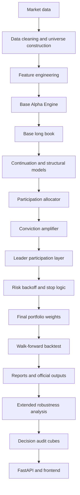
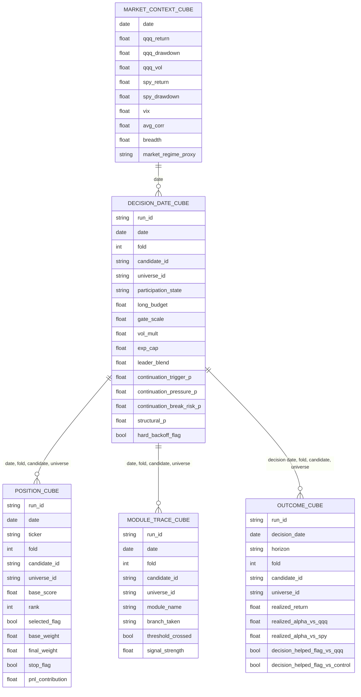

# Mahoraga

Mahoraga is a modular quantitative research system for long-only equity portfolio construction. It focuses on technology and growth-oriented universes and combines interpretable alpha signals, participation-aware capital allocation, structural risk filters, walk-forward validation, robustness testing, and decision-level audit artifacts.

The repository is organized around one frozen official baseline:

| Field | Value |
|---|---|
| Official package | `baseline/mahoraga14_3_baseline` |
| Official variant label | `MAHORAGA14_3_BASELINE_OFFICIAL` |
| Promoted research reference | `Mahoraga14_3R / ROBUST_MAIN / B1.05_C1.10_L1.10_R1.05` |
| Candidate id | `B1.05_C1.10_L1.10_R1.05` |
| Replaced historical control | `Mahoraga14_1_LONG_ONLY_CONTROL` |
| Status | `OFFICIAL_LONG_ONLY_BASELINE` |
| Official role | Frozen long-only research baseline and future long-side research anchor |
| Not included | Broker execution, live trading operations, short sleeves, hedge sleeves, and new discovery grids inside the official baseline |

Mahoraga is a research-complete model baseline and auditable analysis system. It is not a broker execution platform, live trading stack, investment recommendation, or guarantee of future performance.

## Contents

1. [Project Overview](#project-overview)
2. [What Mahoraga Is](#what-mahoraga-is)
3. [Research Objective](#research-objective)
4. [Research Questions and Hypotheses](#research-questions-and-hypotheses)
5. [Repository Structure](#repository-structure)
6. [Research Lineage](#research-lineage)
7. [Official Baseline](#official-baseline)
8. [End-to-End System Architecture](#end-to-end-system-architecture)
9. [Data Pipeline](#data-pipeline)
10. [Data Cleaning and Universe Construction](#data-cleaning-and-universe-construction)
11. [Feature Engineering from First Principles](#feature-engineering-from-first-principles)
12. [Base Alpha Engine](#base-alpha-engine)
13. [Machine Learning Layers](#machine-learning-layers)
14. [Continuation, Structural Defense, and Hawkes-Style Features](#continuation-structural-defense-and-hawkes-style-features)
15. [Portfolio Construction](#portfolio-construction)
16. [Capital Allocation and Participation](#capital-allocation-and-participation)
17. [Risk Management, Backoff, Stops, and Overrides](#risk-management-backoff-stops-and-overrides)
18. [Backtesting and Walk-Forward Validation](#backtesting-and-walk-forward-validation)
19. [Statistical and Economic Metrics](#statistical-and-economic-metrics)
20. [Regression, Alpha, Beta, and Newey-West Adjustment](#regression-alpha-beta-and-newey-west-adjustment)
21. [Robustness and Overfitting Controls](#robustness-and-overfitting-controls)
22. [Official Results](#official-results)
23. [Extended Multiplier Robustness](#extended-multiplier-robustness)
24. [Universe Robustness](#universe-robustness)
25. [Decision Audit Cubes](#decision-audit-cubes)
26. [API and Frontend](#api-and-frontend)
27. [Installation from Fresh Clone](#installation-from-fresh-clone)
28. [Running the Official Baseline](#running-the-official-baseline)
29. [Running Extended Analysis](#running-extended-analysis)
30. [Running the API](#running-the-api)
31. [Running the Frontend](#running-the-frontend)
32. [Running Tests](#running-tests)
33. [Troubleshooting](#troubleshooting)
34. [Limitations](#limitations)
35. [Future Work](#future-work)
36. [References](#references)

## Project Overview

Mahoraga studies whether an interpretable, modular long-only quantitative system can combine stock-selection alpha, regime-aware participation control, and structural risk filters to produce robust risk-adjusted performance in technology and growth-oriented equity universes.

The system has three complementary purposes:

| Purpose | Description |
|---|---|
| Research | Test hypotheses about stock selection, capital deployment, continuation, structural defense, and robustness. |
| Baseline | Preserve one frozen official long-only model as a stable reference point for future work. |
| Audit | Materialize outputs that connect aggregate performance back to folds, dates, tickers, modules, decisions, and future outcomes. |

The official baseline is long-only. It allocates capital to selected equity positions and can hold cash, but it does not short stocks, open hedge positions, or execute trades through a broker.

## What Mahoraga Is

Mahoraga is a quantitative research repository. In this context, quantitative research means using market data, statistical features, portfolio rules, machine learning models, and validation protocols to evaluate whether a repeatable investment process has evidence of economic value.

The project is built around the following objects:

| Object | Meaning in Mahoraga |
|---|---|
| Market data | Historical adjusted prices, volume, benchmarks, and market-context series. |
| Universe | The set of tickers eligible for selection at a point in time. |
| Alpha signal | A measurable feature or score intended to identify relatively attractive long positions. |
| Portfolio | A set of tickers with weights that specify how much capital is assigned to each ticker. |
| Risk layer | A module that changes exposure, budget, or participation when market or portfolio conditions deteriorate. |
| Backtest | A historical simulation of the strategy using rules fixed before the tested interval. |
| Fold | A walk-forward evaluation segment with training, validation, and test periods. |
| Official baseline | The frozen long-only model stored in `baseline/mahoraga14_3_baseline`. |
| Extended analysis | A research audit phase that tests multiplier robustness, universe dependence, and decision traceability. |

The official baseline should be read as an auditable research object. The code, outputs, and documentation show how the model was built and tested, but they do not establish that future returns will resemble historical returns.

## Research Objective

The project-level objective is to evaluate whether a transparent long-only system can:

- rank stocks in a concentrated technology/growth universe using interpretable alpha signals;
- express those signals more strongly when the market path is favorable;
- reduce exposure when structural risk and break risk rise;
- maintain acceptable behavior across walk-forward folds;
- remain locally stable under parameter perturbations;
- remain coherent in nearby technology and growth universes;
- expose enough decision detail for post-hoc audit beyond aggregate backtest metrics.

The objective is not framed as beating one earlier Mahoraga version. Version comparisons matter for lineage and promotion, but the current baseline is best understood as a frozen answer to a broader research question: can a modular long-only architecture combine alpha, participation, and risk filters in a way that is statistically and operationally inspectable?

## Research Questions and Hypotheses

### Research Questions

| Question | Repository evidence |
|---|---|
| Can interpretable alpha signals produce useful stock selection in a concentrated technology/growth universe? | `base_alpha_engine.py`, fold results, stitched comparison, alpha tests. |
| Can participation control reduce underexposure during favorable regimes without destroying drawdown behavior? | `participation_allocator_v2.py`, official candidate metrics, priority-window acceptance, extended budget sensitivity. |
| Can structural defense and continuation layers improve risk-adjusted behavior without making the system an opaque end-to-end black box? | `structural_defense_model.py`, `continuation_v2_model.py`, module traces, continuation diagnostics. |
| Can leader participation help when technology/growth returns concentrate in a small number of strong names? | `leader_participation_layer.py`, leader audit files, upside participation diagnostics. |
| Can the selected official candidate remain stable under parameter perturbations? | Local stability audit, bootstrap summary, extended multiplier robustness. |
| Can the model remain coherent when tested on nearby alternate universes? | Extended universe robustness and coverage audits. |
| Can decision-level audit cubes explain the model beyond stitched performance metrics? | Parquet cubes under `research/mahoraga14_3_extended_analysis/outputs/audit_cube`. |

### Hypotheses

| Hypothesis | Plain-English meaning | How it is tested |
|---|---|---|
| H1. A base alpha engine using trend, momentum, relative momentum, and residualized signals can generate useful long-only stock selection. | Price movement and stock-specific strength should help rank names before final allocation. | Base alpha source code, top-k selection, HRP weighting, fold results, alpha tables. |
| H2. A participation allocator can improve capital deployment by reducing unnecessary cash drag in favorable regimes. | A strategy can miss gains if it stays too much in cash when its signals and market context are strong. | Participation allocator outputs, exposure summaries, return per exposure, priority-window behavior, extended budget sensitivity. |
| H3. Leader participation can help in technology/growth markets where returns may concentrate in a small number of strong names. | Strong regimes in growth equities may be driven by a small set of market leaders. | Leader participation layer, leader audit files, position cube fields, priority-window diagnostics. |
| H4. Risk backoff and structural defense can reduce exposure during fragile regimes without fully suppressing upside participation. | Defense should reduce exposure when conditions deteriorate, but not permanently block the long book. | Risk backoff layer, structural defense model, fold drawdowns, backoff audit, hard-backoff fields. |
| H5. A robust baseline should not depend on a single fragile parameter point. | A useful baseline should remain reasonable around the selected parameter vector. | Local stability, bootstrap, leave-one-window-out, extended multiplier sweeps, plateau radius. |
| H6. The model should remain coherent in nearby technology and growth universes, even if results degrade outside the original universe. | The architecture should not only work on one exact 12-name list. | Universe robustness runs for `tech_20`, `tech_plus_semis`, and `wider_largecap_growth`. |
| H7. Decision audit cubes can make the model more interpretable by linking decisions, positions, modules, outcomes, and market context. | Aggregate returns are not enough; the model should be inspectable by date, ticker, module, and future outcome. | Decision, position, module trace, outcome, and market context cubes. |

## Repository Structure

| Path | Role | Editing guidance |
|---|---|---|
| `README.md` | Root technical entry point. | Keep it aligned with actual files and outputs. |
| `requirements.txt` | Root Python dependency set. | Change only when code dependencies change. |
| `baseline/` | Official baseline packages. | Official baseline files should be treated as frozen unless a deliberate baseline process is being followed. |
| `baseline/mahoraga14_3_baseline/` | Current official long-only baseline. | Use for reproduction, documentation, and official output inspection. Do not use for exploratory tuning. |
| `baseline/mahoraga14_3_baseline/config/` | Official freeze metadata and parameter freeze. | Treat as baseline contract. |
| `baseline/mahoraga14_3_baseline/src/` | Official baseline source package. | Official entrypoints call this package. Some historical runners remain in the package, but the official script is the baseline runner. |
| `baseline/mahoraga14_3_baseline/scripts/` | Scripts for running or regenerating the official baseline. | Preferred entrypoints for baseline reproduction. |
| `baseline/mahoraga14_3_baseline/outputs/` | Official output CSVs and figures. | Generated evidence for the official baseline. |
| `baseline/mahoraga14_3_baseline/audit/` | Official audit files. | Used to explain robustness, acceptance, continuation, and participation behavior. |
| `baseline/mahoraga14_3_baseline/docs/` | Model card, decision flow, freeze notes, component audit, robustness notes, and overfitting notes. | Baseline documentation source. |
| `baseline/mahoraga14_3_baseline/manifests/` | File, output, and baseline manifests. | Provenance and inventory evidence. |
| `baseline/mahoraga14_3_baseline/paper_pack/` | Paper-oriented claim, figure, table, and reference exports. | Supports the baseline paper. |
| `baseline/mahoraga14_3_baseline/tests/` | Import, path, and freeze tests. | Smoke checks for baseline integrity. |
| `research/` | Research archives and active research phases. | New hypotheses should start here, not inside the official baseline. |
| `research/mahoraga14_3_extended_analysis/` | Extended robustness, universe robustness, audit cubes, API, and frontend. | Research-only audit layer over the frozen baseline. |
| `research/mahoraga14_3_extended_analysis/api/` | FastAPI app that reads materialized outputs. | Inspection API, not a live trading service. |
| `research/mahoraga14_3_extended_analysis/frontend/` | React/TypeScript/Tailwind frontend for the extended analysis. | Inspection interface, not a trading UI. |
| `research/legacy/` | Older research versions and related archives. | Historical context only unless explicitly revived in a new research branch. |
| `research/mahoraga15A*` | Short-side and long-short research branches or partial archives. | Research-only, not part of the official long-only baseline. |
| `shared/` | Shared utilities, currently centered on repository path discovery. | Keep minimal and broadly reusable. |
| `docs/` | Governance, methodology, and repository overview documentation. | Defines baseline and research policies. |
| `paper/` | LaTeX paper source, references, and figures. | Paper artifact for the official baseline. |
| `Documentation/` | Additional documentation artifact, including `Mahoraga.pdf`. | Reference material. |
| `Betas/` | Early prototype scripts, plots, and outputs. | Historical scratch and beta artifacts. |
| `data_cache/` | Local cached market/factor data. | Rebuildable cache, not a conceptual source of truth. |

Important governance files:

| File | Purpose |
|---|---|
| `docs/governance/BASELINE_POLICY.md` | Defines active baseline conventions. |
| `docs/governance/PROMOTION_RULES.md` | Defines promotion expectations. |
| `docs/governance/RESEARCH_POLICY.md` | Defines how research archives should be interpreted. |
| `docs/methodology/INSTITUTIONAL_BASELINE.md` | Describes the institutional baseline concept. |
| `docs/repo_overview/TREE.md` | Repository tree overview. |

## Research Lineage

Mahoraga evolved through research stages. The earlier stages matter because they show how the current architecture emerged, but they are not all official baselines.

| Stage | Status | Problem addressed | Contribution to the current baseline |
|---|---|---|---|
| Early `Betas` | Historical prototypes | Initial portfolio, signal, plotting, and output experiments. | Preserved as early development context. |
| Mahoraga 6.1 lineage | Historical foundation | Build a walk-forward long-only engine with universe scheduling, HRP allocation, ATR stop logic, vol targeting, costs, and fold validation. | Provides inherited infrastructure used by the official baseline. |
| Legacy version 7 and news experiments | Historical research | Test earlier dynamic controls and news overlays. | Archived context; not part of the official baseline. |
| Mahoraga 8.2 | Archived legacy concept | Add Hawkes-style transition urgency and Markov-lite regime fusion over a frozen selector. | Contributed transition-intensity thinking, but not the final official architecture. |
| Mahoraga 9 / 9.1 | Archived legacy concept | Study fragility, recovery, residual alpha, fast transition signals, validation utility, and multiple-testing correction. | Strengthened the separation between alpha selection and adaptive policy. |
| Mahoraga 10 | Archived legacy concept | Rebuild around raw directional alpha, residual alpha, beta penalty, and a minimal adaptive policy. | Helped establish the alpha-first design. |
| Mahoraga 11 / 12 | Archived legacy concept | Add path-structure features and exceptional override logic. | Contributed structural defense, transition/recovery framing, and fold-level diagnostics. |
| Mahoraga 13 | Archived legacy concept | Consolidate base alpha, structural defense, transition/recovery, and continuation lift. | Precursor to the 14.x participation architecture. |
| `research/mahoraga14_1_control` | Historical control archive | Preserve a long-only control used as comparison anchor. | Replaced by the official baseline but retained for comparison. |
| `research/mahoraga14_2` | Archived fail-fast research | Test the first bull participation thesis with allocator and backoff. | Informed participation and backoff design. |
| `research/mahoraga14_3` | Archived promising research | Add conviction amplification and leader participation before final acceptance hardening. | Direct predecessor of 14.3R. |
| `research/mahoraga14_3R` | Acceptance archive | Run stability, robustness, and acceptance checks over the frozen 14.3 architecture. | Produced the promoted candidate reference. |
| `baseline/mahoraga14_3_baseline` | Official baseline | Freeze the accepted long-only candidate as the official baseline package. | Current official baseline. |
| `research/mahoraga14_3_extended_analysis` | Extended research audit | Test multiplier robustness, universe dependence, and decision traceability. | Adds audit evidence without changing the official freeze. |
| `research/mahoraga15A*` | Research archives | Explore short-side, hedge, and long-short allocation ideas. | Research-only and separate from the official long-only baseline. |

The official baseline is not a version race. The lineage explains how the final system acquired its current modules: base alpha, path features, continuation, structural defense, participation allocation, leader participation, risk backoff, and auditability.

## Official Baseline

The official baseline lives at:

```text
baseline/mahoraga14_3_baseline
```

The official freeze file is:

```text
baseline/mahoraga14_3_baseline/config/OFFICIAL_FREEZE.json
```

It defines:

| Field | Value |
|---|---|
| `official_variant_label` | `MAHORAGA14_3_BASELINE_OFFICIAL` |
| `official_candidate_id` | `B1.05_C1.10_L1.10_R1.05` |
| `budget_multiplier` | `1.05` |
| `conviction_multiplier` | `1.10` |
| `leader_multiplier` | `1.10` |
| `backoff_strength` | `1.05` |
| `replaced_baseline` | `Mahoraga14_1_LONG_ONLY_CONTROL` |
| `status` | `OFFICIAL_LONG_ONLY_BASELINE` |

The candidate id encodes four multipliers:

| Code | Parameter | Meaning |
|---|---|---|
| `B` | Budget multiplier | Adjusts the allowed long participation budget. |
| `C` | Conviction multiplier | Adjusts how strongly favorable participation evidence is expressed. |
| `L` | Leader multiplier | Adjusts conditional leader participation. |
| `R` | Risk backoff strength | Adjusts the strength of defensive backoff in fragile conditions. |

The official baseline freezes the long-only architecture inherited from `Mahoraga14_3R / ROBUST_MAIN`. It does not freeze or endorse unrelated research branches. Short sleeves, hedge systems, and long-short experiments remain research-only.

## End-to-End System Architecture

Mahoraga separates stock selection from capital deployment. The base alpha engine selects attractive names. Allocation and risk layers decide how much of the selected long book should be expressed.



Main official source modules:

| Module | Official role |
|---|---|
| `mahoraga14_config.py` | Official configuration, folds, parameter grids, model switches, cost settings, and freeze constants. |
| `mahoraga6_1.py` | Inherited engine: data loading, HRP, Ledoit-Wolf covariance, ATR stop, costs, vol targeting, and walk-forward utilities. |
| `mahoraga14_data.py` | Official input loading for equities, QQQ, SPY, VIX, and optional factor data. |
| `base_alpha_engine.py` | Trend, momentum, relative, residual, beta-drag, ranking, HRP base weights, and one-day execution shift. |
| `path_structure_features.py` | Market and portfolio path features: breadth, drawdown, rebound, compression, volatility, correlation, exposure, turnover, and related context. |
| `transition_recovery_model.py` | Transition, recovery, and continuation models plus Hawkes-style decayed event intensities. |
| `continuation_v2_model.py` | Continuation trigger, continuation pressure, and break-risk models. |
| `structural_defense_model.py` | Structural deterioration model. |
| `participation_allocator_v2.py` | Long budget, gate, vol multiplier, exposure cap, cash target, leader blend, and participation state. |
| `conviction_amplifier_layer.py` | Conditional amplification under healthy participation context. |
| `leader_participation_layer.py` | Conditional tilts toward leader names. |
| `risk_backoff_layer_v2.py` | Soft and hard backoff under fragility, break risk, benchmark weakness, or breadth deterioration. |
| `override_policy.py` | Structural defense and continuation-lift policy application. |
| `backtest_executor.py` | Walk-forward orchestration, model fitting, validation selection, stitching, and benchmark comparison. |
| `official_baseline_runner.py` | Official run orchestration. |
| `official_baseline_suite.py` | Official output, figure, manifest, and documentation export. |

## Data Pipeline

### Market Data

The official baseline uses adjusted market data loaded through `yfinance` in the inherited data loader. Market data is organized by trading date and ticker.

OHLCV means:

| Field | Meaning |
|---|---|
| Open | The first traded price in a trading session. |
| High | The highest traded price in the session. |
| Low | The lowest traded price in the session. |
| Close | The final traded price in the session. |
| Volume | The number of shares traded. |

Adjusted prices matter because corporate actions such as splits and dividends can change the raw price series. A model that computes returns from unadjusted prices can mistake a split for a real price collapse. The official loader uses `auto_adjust=True`, which asks yfinance for adjusted price series.

### Benchmarks

Benchmarks provide market context and comparison references.

| Benchmark | Meaning in the repository |
|---|---|
| `QQQ` | Nasdaq-100 ETF proxy. It is the main technology/growth benchmark. |
| `SPY` | S&P 500 ETF proxy. It is the broad-market benchmark. |
| `^VIX` | Volatility index proxy used for market stress context where available. |

Benchmarks are aligned by date with equity returns so that stock signals, market context, and strategy outcomes refer to the same trading day.

### Official Universe

The official static equity universe is:

```text
AAPL, MSFT, NVDA, GOOGL, AMZN, META, AVGO, ASML, TSM, ADBE, NFLX, AMD
```

The inherited engine also includes a canonical universe schedule with seasoning, liquidity/size proxies, retention buffers, and quarterly reconstruction logic. In the official baseline, the static universe provides the long-only research universe used by the frozen outputs.

### Data Coverage

Data coverage matters because a ticker with missing or late-starting data can distort rankings, returns, covariance estimates, and universe membership. The extended universe coverage audit explicitly checks ticker availability for alternate universes. For example, some growth names have partial coverage because they were listed after the full data start date.

## Data Cleaning and Universe Construction

The official data process includes:

| Step | Purpose |
|---|---|
| Adjusted price loading | Reduces corporate-action artifacts in return series. |
| Trading-day alignment | Ensures stocks, benchmarks, and market context line up by date. |
| Limited forward fill | The inherited loader uses a forward-fill limit of 5 observations for missing values. |
| Coverage checks | Prevents treating unavailable data as valid history. |
| Seasoning logic | Helps avoid newly listed names without enough history where the canonical schedule is active. |
| Liquidity/size proxies | Support universe quality filters in inherited universe construction. |
| Benchmark alignment | Makes relative momentum, beta, alpha, and market context meaningful. |
| Feature shifting | Reduces obvious look-ahead by using information available before execution. |
| One-day execution shift | Final weights are shifted before realized returns are computed. |

Look-ahead bias is one of the main risks in backtesting. A strategy has look-ahead bias if it uses information that would not have been known at the time of the decision. Mahoraga reduces obvious look-ahead through shifted features, shifted weights, fold separation, and validation checks. These safeguards do not eliminate all data-quality limitations, especially because yfinance is not a fully institutional point-in-time security master.

## Feature Engineering from First Principles

Feature engineering converts raw market data into variables used by the alpha engine, machine learning models, allocation modules, and risk layers.

### Returns

A simple return measures the percentage change in price from one time step to the next:

```text
r_t = P_t / P_{t-1} - 1
```

If a stock rises from 100 to 105, the simple return is 5%. Mahoraga uses daily return series for portfolio simulation, covariance estimation, regression, and performance metrics.

Log returns are often written as:

```text
log(P_t / P_{t-1})
```

Log returns are useful in some statistical settings because they add across time, but the official performance reports are expressed in ordinary portfolio-return terms such as CAGR, Sharpe, Sortino, and MaxDD.

### Trend

Trend describes the direction and persistence of price movement over time. A rising price series with positive moving-average slopes has a positive trend. Trend features help the model avoid treating every short-term bounce as a high-quality long signal.

### Momentum

Momentum is the empirical tendency of assets that have recently performed well to continue performing well over some horizons. Momentum has support in asset-pricing literature, but it is unstable across regimes and can reverse sharply.

Mahoraga uses multi-window momentum concepts as part of the base alpha engine.

### Relative Momentum

Relative momentum compares a stock to a benchmark or peer context. A stock can have positive absolute return but still underperform QQQ. Relative momentum helps separate names that are strong in absolute terms from names that are strong relative to the relevant technology/growth benchmark.

### Residual Momentum and Residual Alpha

Residual momentum means strength that remains after removing broad market or factor-like movement. In Mahoraga, the base alpha engine uses ridge residualization against broad benchmark and technology context series, including QQQ, SPY, a technology basket, and a first principal component proxy.

The goal is to identify stock-specific strength rather than simply rewarding any stock that moved because the whole benchmark moved.

### Beta Drag

Beta measures how sensitive a strategy or stock is to a benchmark. High beta can help in bull markets but hurt in drawdowns. Beta drag penalizes exposure that appears to be benchmark risk rather than stock-specific alpha, especially when the benchmark context is weak.

### Drawdown

Drawdown is the decline from a previous peak:

```text
drawdown_t = current_value_t / running_peak_t - 1
```

A portfolio that grows to 1.00, falls to 0.80, and then recovers has a -20% drawdown at the trough. Drawdown matters because many risk reviews care not only about average volatility but also about the depth and duration of losses.

### Volatility

Realized volatility measures how much returns vary over a historical window. Higher volatility means larger day-to-day return fluctuations. Mahoraga uses volatility in risk context, portfolio scaling, and performance metrics.

### Correlation

Correlation measures how assets move together. If all selected stocks become highly correlated, diversification falls because positions are likely to gain or lose together. Mahoraga uses correlation context and HRP allocation to account for co-movement among selected names.

### Covariance and Covariance Shrinkage

Covariance measures how two assets move together in return units. It is central to risk allocation because portfolio risk depends not only on individual volatility but also on cross-asset covariance.

The inherited engine implements Ledoit-Wolf covariance shrinkage inside `mahoraga6_1.py`. Shrinkage stabilizes covariance estimates by blending the sample covariance matrix toward a more stable target. This is useful when the number of assets is not large but the sample can still be noisy.

### Breadth

Breadth measures how many names participate in a market move. A rally led by many stocks is broader than a rally driven by one or two names. Weak breadth can indicate fragility even if the index is rising.

### Fragility

Fragility is a risk context where trends may break, volatility may rise, breadth may weaken, drawdowns may deepen, or correlations may increase. In Mahoraga, fragility is not one raw data column. It is a risk concept represented by path features and model outputs that influence backoff and structural defense.

### Cash Drag

Cash drag occurs when the model holds too much cash during a favorable regime. Cash can reduce losses during bad regimes, but it can also reduce returns when selected long signals are strong.

### Turnover

Turnover measures how much the portfolio changes from one period to another. Higher turnover can increase transaction costs and slippage.

## Base Alpha Engine

The base alpha engine answers one question: which names look attractive before final allocation and risk layers are applied?

It does not decide the final exposure by itself. It creates a ranked long book that later modules can amplify, reduce, or partially block.

### Score and Rank

A score is a numeric summary of signal evidence for a ticker on a date. A higher score means the model views the name as more attractive according to the base alpha logic. A rank orders tickers by score.

The base engine combines:

| Component | Role |
|---|---|
| Raw trend | Rewards persistent positive price direction. |
| Raw momentum | Rewards recent strength over selected horizons. |
| Relative momentum | Rewards strength versus benchmark context. |
| Residual signal | Rewards strength not explained by broad benchmark movement. |
| Beta drag | Penalizes benchmark-like exposure when it is less desirable. |
| Cross-sectional z-scores | Standardizes signals so names can be compared on the same date. |

### From Scores to Base Book

The official baseline uses concentrated top-k selection:

| Parameter | Value |
|---|---:|
| `top_k` | `3` |
| Weight cap | `0.60` |
| HRP lookback window | `252` trading days |
| Rebalance frequency | Weekly Friday (`W-FRI`) |

The base alpha engine ranks names, selects the top candidates, and assigns base weights. Those base weights are constructed using HRP with Ledoit-Wolf covariance estimation where enough data is available, with fallback behavior for degenerate or insufficient data.

The base book is not the final portfolio. The final portfolio also depends on continuation, structural defense, participation, leader participation, backoff, stops, exposure caps, gates, volatility scaling, cash targets, and transaction costs.

## Machine Learning Layers

Machine learning in Mahoraga is a supporting layer. It estimates probabilities and context scores used by deterministic allocation and risk logic. It is not an end-to-end black-box portfolio optimizer.

### Supervised Learning Concepts

A classification target is the event a model is trained to predict. For example, a model may learn whether a future path is likely to show continuation or break risk based on current features.

A probability output is a number between 0 and 1. A value near 1 means the model assigns high probability to the event; a value near 0 means low probability. These probabilities are not certainties.

AUC, or area under the ROC curve, measures how well a classifier ranks positive examples above negative examples. AUC is useful for validation, but it does not prove that a model will remain profitable or stable in future market regimes.

### Logistic Regression

Logistic regression estimates the probability of an event by applying a logistic transformation to a linear combination of features. It is more interpretable than many nonlinear models because each feature enters through a linear coefficient before the probability transformation.

Mahoraga uses logistic regression with scaling and class balancing in the structural, transition/recovery, and continuation model code.

### Random Forest

A random forest combines many decision trees. It can capture nonlinear interactions that logistic regression may miss. It is less transparent than logistic regression and can overfit if not constrained.

Mahoraga uses random forest classifiers as optional challenger models. The configured official source includes random forest settings such as limited depth and leaf-size constraints. Validation AUC is used to choose between the logistic model and challenger model where the challenger path is enabled.

### Implemented Model Families

| Model family | Source module | Model type | Target concept | Output | Effect on decisions |
|---|---|---|---|---|---|
| Structural defense | `structural_defense_model.py` | Logistic regression with optional random forest challenger | Deteriorating structural path based on future returns, drawdown behavior, relative returns, and duration-style features | `structural_p` | Supports defense and backoff decisions. |
| Transition | `transition_recovery_model.py` | Logistic regression with optional random forest challenger | Stress or transition conditions using path and benchmark features | Transition probability and related features | Supports fast regime-change context. |
| Recovery | `transition_recovery_model.py` | Logistic regression with optional random forest challenger | Recovery conditions after stress or drawdown | Recovery probability and Hawkes-style recovery intensity | Supports continuation and participation context. |
| Continuation trigger | `continuation_v2_model.py` | Logistic regression with optional random forest challenger | Whether a constructive continuation setup is active | `continuation_trigger_p` | Helps decide whether continuation context is present. |
| Continuation pressure | `continuation_v2_model.py` | Logistic regression with optional random forest challenger | Whether upside pressure remains favorable | `continuation_pressure_p` | Supports participation strength when other guards allow it. |
| Break risk | `continuation_v2_model.py` | Logistic regression with optional random forest challenger | Whether the continuation path is at risk of breaking | `continuation_break_risk_p` | Can block or reduce participation. |

The models use engineered path, benchmark, breadth, volatility, exposure, drawdown, rebound, and transition-intensity features. They are judged inside the walk-forward process, not trained once on the full history and blindly applied to the same history.

## Continuation, Structural Defense, and Hawkes-Style Features

### Continuation

Continuation means a move may continue rather than immediately reverse. In Mahoraga, continuation is not a guarantee. It is a probability and quality-filter concept.

The continuation layer includes:

| Component | Meaning |
|---|---|
| Continuation trigger | Whether the setup looks like a continuation candidate. |
| Continuation pressure | Whether evidence supports stronger upside participation. |
| Continuation break risk | Whether the continuation setup appears vulnerable to failure. |

Continuation can support participation when context is healthy, but it can be limited by break risk, structural defense, benchmark weakness, fragility, or hard backoff.

### Structural Defense

Structural defense tries to detect deterioration in the market path or portfolio context. It is not a crash predictor. It is a risk-control signal used to reduce or reshape participation when the structure of the path becomes fragile.

The structural defense model produces `structural_p`. Higher structural probability can contribute to defensive override behavior and risk backoff.

### Hawkes-Style Transition Features

A Hawkes process is a self-exciting point process. Self-exciting means that one event can temporarily increase the likelihood of additional events. In markets, stress events can cluster: a sharp loss, volatility spike, or breadth failure can be followed by more stress before the system stabilizes.

Mahoraga implements Hawkes-style decayed event intensities, not a full continuous-time Hawkes estimation system. The source module `transition_recovery_model.py` builds stress and recovery intensities by applying exponential-style decay to event indicators. The official configuration includes:

| Parameter | Value |
|---|---:|
| `use_hawkes` | `True` |
| `hawkes_event_q_low` | `0.25` |
| `hawkes_event_q_high` | `0.75` |
| `hawkes_decay` | `0.70` |

The resulting features, including `transition_hawkes_stress` and `transition_hawkes_recovery`, help represent fast changes in regime, clustered stress, and recovery intensity. They are feature-engineering tools, not a claim that the strategy estimates a full Hawkes process.

### Physics-Inspired Language

Some older research language uses words such as pressure, turbulence, flow, compression, and fragility. These terms are conceptual analogies for market path behavior. They describe instability, clustering, path compression, breadth weakening, or regime transition.

The repository does not implement Navier-Stokes equations or continuous physical flow equations. Statistical validation, walk-forward testing, and audit outputs remain the basis for evaluating the model.

## Portfolio Construction

A portfolio is a set of positions with weights. A weight is the fraction of capital assigned to a ticker. A 20% weight in `NVDA` means 20% of portfolio capital is allocated to `NVDA` before considering leverage, cash, or execution details.

In the official long-only baseline:

- weights can be positive or zero;
- short weights are not part of the official baseline;
- cash is allowed;
- selected stocks are not always fully expressed;
- final weights depend on alpha, HRP allocation, caps, stops, gates, budget, volatility scaling, leader participation, and risk backoff.

### Top-k Selection

Top-k selection means selecting the highest-ranked tickers. With `top_k = 3`, the base engine selects up to three names from the eligible universe at each rebalance.

### Base Weight and Final Weight

Base weight is the weight proposed by the base alpha and HRP allocation layer. Final weight is the weight after participation, leader, backoff, stop, gate, exposure cap, and cost logic.

Example:

```text
Base alpha selects: NVDA, MSFT, AAPL
Base weights:       40%, 35%, 25%
Risk context:       fragile
Final exposure:     reduced to 45%
Final weights:      18%, 16%, 11%, with the remainder in cash
```

If the market context is favorable and participation is allowed, the model may express more of the selected long book. If risk backoff is active, the same selected names may be held with lower final exposure.

## Capital Allocation and Participation

Capital allocation decides how strongly the model expresses its selected long book.

### Budget

Budget is the amount of long exposure the system is allowed to express. It is not the account balance. It is a model-level allowance for capital deployment into long positions.

### Long Budget

Long budget is the portion of the portfolio that may be allocated to long positions. A long budget of 0.80 means the model may deploy up to 80% of capital into long positions, subject to other caps and gates.

### Exposure

Exposure measures how much of the portfolio is invested. In a long-only portfolio, 65% exposure means roughly 65% invested and 35% in cash.

### Participation

Participation is how strongly the model expresses the selected long book. In technology and growth markets, participation matters because upside can be concentrated and fast. A model with correct stock selection can still underperform if it holds too much cash during favorable regimes.

### Cash Drag and Underexposure

Cash drag occurs when uninvested cash reduces returns during favorable markets. Underexposure occurs when the model has useful long signals but does not deploy enough capital to benefit from them.

The extended analysis shows asymmetric robustness. The official candidate does not collapse under every small perturbation. It is stable across several sampled changes, especially conviction, leader participation, and backoff. The main sensitivity is budget underdeployment. Lowering budget below the official level can harm performance because the model's edge depends on sufficiently expressing long signals during favorable technology/growth regimes.

### Official Participation Multipliers

| Parameter | Official value | Practical effect |
|---|---:|---|
| `budget_multiplier` | `1.05` | Slightly raises allowed long deployment when allocator context supports it. |
| `conviction_multiplier` | `1.10` | Strengthens participation translation under favorable context. |
| `leader_multiplier` | `1.10` | Strengthens conditional leader participation. |
| `backoff_strength` | `1.05` | Slightly strengthens defensive scaling under fragile conditions. |

## Risk Management, Backoff, Stops, and Overrides

Risk management is broader than avoiding losses. It includes volatility, drawdown, concentration, correlation, turnover, liquidity, model error, benchmark dependence, and path instability.

### Backoff

Backoff is a reduction in participation when risk context deteriorates. It is not a short signal and not a guarantee against losses. It reduces how much of the long book is expressed.

Backoff in Mahoraga responds to:

- break risk;
- fragility;
- benchmark weakness;
- structural probability;
- breadth weakness;
- weak continuation context;
- hard guard conditions.

### Hard Backoff

Hard backoff is a stronger defensive state. It can cap the long budget more severely, remove leader blend, reset conviction/leader multipliers, and increase the cash target.

### Gate Scale

Gate scale controls how much of a signal or policy path is allowed through. A lower gate scale reduces realized participation even if the base alpha book is strong.

### Volatility Multiplier

The volatility multiplier adjusts exposure according to risk or volatility context. Higher realized volatility can reduce the amount of capital deployed.

### Exposure Cap

The exposure cap limits total portfolio exposure. It prevents the strategy from exceeding the maximum allowed invested fraction under a given context.

### Structural Probability

Structural probability, reported as `structural_p`, estimates deterioration or fragile structure. It is one input into structural defense and backoff logic.

### Stop Logic and ATR

ATR means Average True Range. It measures recent price range and acts as a volatility-aware distance measure.

The inherited engine implements Chandelier-style ATR stop logic. A Chandelier stop is a trailing stop based on the highest high and an ATR multiple. The official baseline uses:

| Stop parameter | Value |
|---|---:|
| ATR window | `14` |
| Official ATR multiplier | `3.0` |
| `stop_on` | `True` |
| `allow_reentry` | `True` |
| `stop_keep_cash` | `True` |

When a stop removes a position, stopped weight is kept as cash under the configured behavior. No separate take-profit module is part of the official baseline package. The extended representative audit subset records zero stop activations, so the presence of stop code should not be interpreted as evidence that stop events drove the official result.

### Overrides

Overrides are exceptional policy adjustments. The official code includes structural defense and continuation-lift logic in `override_policy.py`. Overrides can change gate, volatility, exposure, and defense behavior, but they remain constrained by the long-only architecture and risk layers.

## Backtesting and Walk-Forward Validation

A backtest simulates how a strategy would have performed historically if its rules had been applied at the time.

A walk-forward test divides history into folds. Each fold has earlier periods used for training or calibration, validation periods used for model or parameter selection, and a test period used for out-of-sample reporting.

Key terms:

| Term | Meaning |
|---|---|
| Train/calibration window | Earlier data used to fit models, thresholds, and candidate settings. |
| Validation window | Data used to compare candidate behavior before test reporting. |
| Embargo | A gap that reduces leakage between training/validation and test periods. |
| Test/OOS window | Out-of-sample period reported for that fold. |
| Stitched OOS | The test slices from all folds joined into one performance series. |
| Fold damage | A deterioration concentrated in one walk-forward fold. |

The official stitched results are built from five test folds:

| Fold | Test start | Test end |
|---:|---|---|
| 1 | `2017-01-03` | `2018-12-31` |
| 2 | `2019-01-02` | `2020-12-31` |
| 3 | `2021-01-04` | `2022-12-30` |
| 4 | `2023-01-03` | `2024-06-28` |
| 5 | `2024-07-01` | `2026-02-20` |

Walk-forward validation helps reduce overfitting because decisions are evaluated on periods after the calibration data. It does not prove future returns. Markets can change, data can be revised, and a strategy can fail outside the historical regimes tested.

## Statistical and Economic Metrics

### CAGR

CAGR means compound annual growth rate:

```text
CAGR = (ending_value / starting_value)^(1 / years) - 1
```

It answers: what constant annual growth rate would produce the same total return? CAGR includes compounding. A higher CAGR is better if risk is acceptable.

### Sharpe Ratio

Sharpe ratio measures return per unit of volatility:

```text
Sharpe = mean(excess_return) / standard_deviation(excess_return)
```

Daily Sharpe is commonly annualized by multiplying by the square root of the number of trading days. Higher Sharpe indicates better volatility-adjusted return, but Sharpe treats upside and downside volatility symmetrically.

### Sortino Ratio

Sortino ratio is similar to Sharpe but penalizes downside volatility rather than all volatility. A higher Sortino indicates better downside-risk-adjusted performance. It can be more informative when upside volatility is not considered harmful.

### Max Drawdown

MaxDD is the worst peak-to-trough loss:

```text
MaxDD = min(portfolio_value_t / running_peak_t - 1)
```

A less negative MaxDD is better. A strategy with high CAGR but severe MaxDD may be unacceptable for many risk mandates.

### Upside Capture and Downside Capture

Upside capture measures how much of benchmark gains the strategy captures during benchmark-up periods. Downside capture measures how much of benchmark losses the strategy experiences during benchmark-down periods. Lower downside capture and adequate upside capture are desirable, but the interpretation depends on the benchmark and exposure level.

### Turnover

Turnover measures how much the portfolio changes. High turnover increases the importance of transaction-cost and slippage assumptions.

### Slippage and Transaction Costs

Transaction costs are direct trading costs. Slippage is the difference between expected execution price and actual execution price. Backtests that ignore them can overstate performance. The official baseline includes cost and slippage stress outputs.

### Return per Exposure

Return per exposure measures performance relative to average invested exposure. It helps compare a strategy that holds cash against benchmarks that are fully invested.

### Robustness Metrics

| Metric | Meaning |
|---|---|
| Fold damage | Candidate deterioration in a specific fold. |
| Severe fold damage count | Number of folds where a candidate breaches robustness damage thresholds. |
| Distance to decay | Minimum relative perturbation needed to trigger degradation conditions. |
| Plateau radius | How far a parameter can move while staying within robustness thresholds in sampled tests. |
| Robust region share | Fraction of sampled parameter perturbations that remain robust. |

## Regression, Alpha, Beta, and Newey-West Adjustment

Regression estimates how a strategy's returns relate to a benchmark:

```text
r_strategy = alpha + beta * r_benchmark + error
```

| Term | Meaning |
|---|---|
| `alpha` | Intercept. Return not explained by benchmark exposure in the regression. |
| `beta` | Slope. Sensitivity to benchmark returns. |
| `error` | Residual return not explained by the benchmark regression. |

Alpha is not the same as total return. A strategy can have high total return because it has high benchmark beta. Regression helps separate benchmark exposure from residual performance.

Daily strategy returns can have autocorrelation and heteroskedasticity. Autocorrelation means returns are related over time. Heteroskedasticity means return variance changes over time. Newey-West standard errors adjust statistical inference for these issues. Mahoraga reports Newey-West alpha versus QQQ and SPY.

### p-values

A p-value is the probability of seeing a result at least as extreme under a null hypothesis. A small p-value suggests the observed result would be unlikely under the null. It does not prove that a model is true, profitable, or stable.

### q-values and Multiple Testing

When many variants are tested, some can look good by chance. A q-value adjusts p-values for multiple testing. Mahoraga includes Benjamini-Hochberg-Yekutieli style q-value logic through `bhy_qvalues`. Benjamini-Yekutieli correction is designed to control false discovery under dependence assumptions.

## Robustness and Overfitting Controls

Mahoraga uses several defenses against overfitting:

| Control | Role |
|---|---|
| Walk-forward folds | Evaluate on test windows after calibration. |
| Fold-level reporting | Reveals whether stitched performance hides weak local behavior. |
| Priority-window acceptance | Checks important upside windows and comparison versus control. |
| Local stability | Tests whether the official candidate sits in a robust neighborhood. |
| Stationary bootstrap | Resamples path behavior to estimate distributional robustness. |
| Leave-one-window-out | Tests whether selection survives excluding key windows. |
| Model-selection guard | Reality-check-style guard against choosing a fragile local winner. |
| Cost and slippage stress | Tests whether performance survives less favorable execution assumptions. |
| Extended multiplier sweeps | Perturbs official multipliers and measures degradation. |
| Universe robustness | Tests nearby alternate universes and coverage. |
| Audit cubes | Link decisions and modules to realized outcomes. |

These controls reduce overfitting risk. They do not eliminate it. A backtest can still fail in future regimes, under different market microstructure, or with a different universe definition.

## Official Results

Official stitched comparison from `baseline/mahoraga14_3_baseline/outputs/stitched_comparison_official.csv`:

| Series | CAGR | Sharpe | Sortino | MaxDD | Beta QQQ | Beta SPY | Alpha NW vs QQQ | Avg exposure | Avg turnover |
|---|---:|---:|---:|---:|---:|---:|---:|---:|---:|
| `QQQ` | 20.14% | 0.918 | 1.456 | -35.24% | 1.000 | 1.160 | 0.000 | 1.000 | 0.000 |
| `SPY` | 14.88% | 0.846 | 1.309 | -33.72% | 0.752 | 1.000 | -0.002 | 1.000 | 0.000 |
| `MAHORAGA14_1_LONG_ONLY_CONTROL` | 24.68% | 1.194 | 2.006 | -20.24% | 0.485 | 0.468 | 0.149 | 0.632 | 0.0345 |
| `MAHORAGA14_3_BASELINE_OFFICIAL` | 32.55% | 1.483 | 2.528 | -16.20% | 0.516 | 0.508 | 0.215 | 0.653 | 0.0497 |

Official fold summary from `baseline/mahoraga14_3_baseline/outputs/fold_summary_official.csv`:

| Fold | Official CAGR | Official Sharpe | Official MaxDD | Control CAGR | QQQ CAGR | SPY CAGR |
|---:|---:|---:|---:|---:|---:|---:|
| 1 | 13.77% | 0.829 | -13.71% | 10.55% | 14.94% | 7.80% |
| 2 | 46.53% | 1.815 | -16.20% | 27.43% | 43.22% | 24.56% |
| 3 | 13.40% | 0.799 | -13.10% | 11.66% | -7.51% | 2.64% |
| 4 | 107.51% | 2.969 | -11.57% | 98.05% | 49.24% | 28.68% |
| 5 | 13.70% | 0.782 | -14.45% | 5.62% | 15.54% | 16.38% |

The official baseline beats the historical control in fold-level CAGR across all five official folds. It does not beat QQQ in every fold. QQQ has higher CAGR in fold 1 and fold 5, and SPY has higher CAGR in fold 5.

Newey-West alpha from `baseline/mahoraga14_3_baseline/outputs/alpha_nw_official.csv`:

| Series | Benchmark | Annualized alpha | t-stat | p-value | Beta | R2 |
|---|---|---:|---:|---:|---:|---:|
| Control | QQQ | 0.149 | 2.490 | 0.0128 | 0.485 | 0.302 |
| Control | SPY | 0.183 | 2.716 | 0.0066 | 0.468 | 0.182 |
| Official | QQQ | 0.215 | 3.613 | 0.0003 | 0.516 | 0.333 |
| Official | SPY | 0.251 | 3.739 | 0.0002 | 0.508 | 0.209 |

Pairwise p/q-value table from `baseline/mahoraga14_3_baseline/outputs/pvalue_qvalue_official.csv`:

| Comparison | p-value | q-value | CAGR delta | Sharpe delta | Sortino delta | MaxDD delta |
|---|---:|---:|---:|---:|---:|---:|
| Official vs Control | 0.0032 | 0.0174 | 7.87 | 0.289 | 0.522 | 4.04 |
| Official vs QQQ | 0.0804 | 0.1473 | 12.41 | 0.565 | 1.072 | 19.04 |
| Official vs SPY | 0.0144 | 0.0397 | 17.67 | 0.636 | 1.219 | 17.52 |

Priority-window results from `baseline/mahoraga14_3_baseline/outputs/priority_window_acceptance_official.csv`:

| Window | Official return | Control return | QQQ return | SPY return | Gate status |
|---|---:|---:|---:|---:|---|
| `2017_2018` | 29.30% | 22.13% | 31.97% | 16.14% | PASS |
| `2020_2021` | 90.74% | 68.81% | 109.97% | 89.10% | PASS |
| `2023_2024` | 207.17% | 174.80% | 93.69% | 57.58% | PASS |

The priority windows pass the acceptance gate because they improve or preserve the required control comparison and local quality checks. The raw table also shows that QQQ outperformed official in `2017_2018` and `2020_2021`.

Execution-stress outputs:

| Scenario | CAGR | Sharpe | Sortino | MaxDD | Alpha NW vs QQQ |
|---|---:|---:|---:|---:|---:|
| Baseline | 32.55% | 1.483 | 2.528 | -16.20% | 0.215 |
| Cost plus 25 | 32.02% | 1.463 | 2.493 | -16.31% | 0.210 |
| Cost plus 50 | 31.48% | 1.443 | 2.457 | -16.41% | 0.205 |
| Cost plus 100 | 30.42% | 1.404 | 2.386 | -16.63% | 0.195 |
| Slippage plus 5 bps | 31.73% | 1.452 | 2.473 | -16.36% | 0.207 |

Exposure, turnover, and return per exposure:

| Metric | Official | Control |
|---|---:|---:|
| Mean exposure | 0.653 | 0.632 |
| Median exposure | 0.915 | 0.778 |
| p95 exposure | 0.972 | 1.000 |
| Mean turnover | 0.0497 | 0.0345 |
| p95 turnover | 0.341 | 0.264 |
| Return per exposure | 0.001838 | 0.001514 |

Selected official audit results:

| Audit file | Result |
|---|---|
| `audit/bootstrap_summary_official.csv` | Candidate CAGR p50 `0.3177`, mean `0.3252`, p05 `0.2080`; candidate Sharpe p50 `1.4691`, p05 `1.0349`. |
| `audit/local_stability_summary_official.md` | Official robust score `0.9951`, robust flag `1`, local rank `1`, plateau share `50.62%`. |
| `audit/model_selection_guard_official.md` | Local family reality-check p-value `0.0000`; official centered bootstrap p-value `0.0000`. |
| `audit/leave_one_window_out_summary_official.md` | Official candidate selected in every exclusion experiment. |
| `audit/acceptance_decision_official.md` | Priority windows recorded as `PASS`; gate role `ROBUST_MAIN`. |
| `audit/continuation_diagnostic_official.csv` | Stitched activations `10`, activation rate `0.0368`, 4-week hit rate `0.5833`. |

## Extended Multiplier Robustness

The extended analysis lives at:

```text
research/mahoraga14_3_extended_analysis
```

It audits the frozen baseline. It does not define a new official baseline and does not reoptimize the official candidate.

From `outputs/reports/final_extended_analysis_report.md`:

| Metric | Value |
|---|---:|
| Official CAGR | 32.5518% |
| Official Sharpe | 1.4826 |
| Official Sortino | 2.5280 |
| Official MaxDD | -16.1997% |
| Sampled candidates | 42 |
| `distance_to_decay` | 0.0476 |
| `robust_region_share_extended` | 64.29% |

Sensitivity ranking:

| Axis | Sensitivity score | Worst sampled candidate | Worst Sharpe drop | Worst CAGR drop | Worst MaxDD worsening | Severe fold damage count |
|---|---:|---|---:|---:|---:|---:|
| Budget | 5.567 | `B0.90_C1.10_L1.10_R1.05` | 0.190 | 0.294 | 0.415 | 5 |
| Leader | 0.178 | `B1.05_C1.10_L0.90_R1.05` | 0.050 | 0.074 | 0.267 | 0 |
| Backoff | 0.150 | `B1.05_C1.10_L1.10_R0.90` | 0.029 | 0.019 | 0.512 | 0 |
| Conviction | 0.076 | `B1.05_C0.90_L1.10_R1.05` | 0.029 | 0.045 | 0.006 | 0 |

Plateau radius:

| Axis | Official value | Robust min | Robust max | Relative plateau radius |
|---|---:|---:|---:|---:|
| Budget | 1.05 | 1.05 | 1.15 | 0.000 |
| Conviction | 1.10 | 0.90 | 1.30 | 0.182 |
| Leader | 1.10 | 0.90 | 1.30 | 0.182 |
| Backoff | 1.05 | 0.90 | 1.20 | 0.143 |

Interpretation:

The extended analysis does not show that the model collapses under any small perturbation. It shows asymmetric robustness. The official candidate is stable across several sampled perturbations, particularly conviction, leader participation, and backoff. The main sensitivity is budget underdeployment. Lowering budget below the official level can harm performance because the model's edge depends on sufficiently expressing long signals during favorable technology/growth regimes.

## Universe Robustness

Extended universe robustness tests the official candidate on nearby universes.

| Universe | Usable count | CAGR | Sharpe | Sortino | MaxDD | Alpha NW vs QQQ | Status |
|---|---:|---:|---:|---:|---:|---:|---|
| `base_universe_12` | 12 | 32.55% | 1.483 | 2.528 | -16.20% | 0.215 | OK |
| `tech_20` | 20 | 29.96% | 1.381 | 2.380 | -19.48% | 0.191 | OK |
| `tech_plus_semis` | 23 | 30.92% | 1.372 | 2.327 | -19.69% | 0.200 | OK |
| `wider_largecap_growth` | 24 | 24.93% | 1.203 | 2.054 | -21.17% | 0.154 | OK |
| `negative_control_nontech` | 16 | Not available | Not available | Not available | Not available | Not available | Aborted by compute budget after coverage audit |

The alternate technology and growth universes retain positive results, though performance degrades outside the original 12-name universe. The non-technology negative-control universe has coverage materialized, but completed walk-forward metrics are not present in the recorded extended run.

## Decision Audit Cubes

The extended analysis creates Parquet audit cubes under:

```text
research/mahoraga14_3_extended_analysis/outputs/audit_cube
```

The cubes are Parquet files, not SQL tables. They are post-hoc audit artifacts generated by the extended analysis. Conceptually, they behave like a star-schema-style analytical layer: fact-like tables can be sliced by date, fold, candidate, universe, ticker, module, horizon, and market regime.

### Cube Inventory

| Cube | Rows | Purpose |
|---|---:|---|
| `decision_date_cube.parquet` | 13,770 | Date-level allocator state, participation state, controls, continuation/backoff/leader signals, expected exposure, and turnover. |
| `position_cube.parquet` | 165,240 | Date/ticker-level scores, ranks, selected flags, weights, stop flags, forward returns, and PnL contribution. |
| `module_trace_cube.parquet` | 96,390 | Date/module-level branches, thresholds, signal strengths, and JSON summaries of inputs and outputs. |
| `outcome_cube.parquet` | 41,310 | Decision-date outcomes by horizon, including realized return and benchmark-relative helped flags. |
| `market_context_cube.parquet` | 2,295 | Date-level QQQ/SPY returns, drawdowns, volatility, breadth, VIX, and market-regime proxies. |

Representative granular candidates are limited to:

```text
B1.05_C1.10_L1.10_R1.05
EXTREME_pro-risk
EXTREME_pro-defense
B0.90_C1.10_L1.10_R1.05
B1.05_C1.10_L0.90_R1.05
B1.05_C0.90_L1.10_R1.05
```

This limit is intentional. The extended multiplier sweep is an audit sample, not a full production catalogue of ticker-date-module traces for every perturbation.

### ER Diagram



### Analytical Dimensions

| Dimension | Meaning |
|---|---|
| `date` | Trading date or decision date. |
| `fold` | Walk-forward fold. |
| `candidate_id` | Official or perturbed candidate identifier. |
| `universe_id` | Universe used for the run. |
| `ticker` | Equity ticker in the position cube. |
| `module_name` | Module name in the trace cube. |
| `horizon` | Future outcome horizon. |
| `market_regime_proxy` | Market-context grouping field. |

### Cube Operations

| Operation | What it does | Why it matters | Example interpretation |
|---|---|---|---|
| Slice | Filter one dimension. | Isolates a single candidate, fold, date, ticker, or module. | Filter official candidate only to inspect baseline behavior. |
| Dice | Filter multiple dimensions. | Narrows the audit to a specific context. | Inspect official candidate, fold 3, `NVDA`, selected days only. |
| Drill-down | Move from aggregate performance to fold, date, ticker, and module detail. | Shows which decisions contributed to a high-level result. | Start from weak fold performance and inspect dates with hard backoff. |
| Roll-up | Aggregate granular data by fold, module, ticker, or regime. | Summarizes detailed traces without losing lineage. | Group PnL contribution by ticker or helped flags by module. |
| Join decision to outcome | Connect a decision state with future realized returns. | Evaluates whether a state helped after the decision date. | Compare hard-backoff dates with 20-day alpha versus QQQ. |
| Module attribution | Group traces by `module_name` and branch. | Shows which modules influenced decisions. | Count leader-layer activation branches. |
| Regime audit | Join decisions with market context. | Tests whether modules behave differently in stress or strong benchmark regimes. | Compare participation states when benchmark weakness is high. |
| Ticker audit | Inspect selected names and PnL contribution. | Links stock selection to realized contribution. | Review selected `NVDA` positions and forward returns. |
| Backoff audit | Evaluate whether risk reduction helped. | Tests defensive behavior rather than assuming it helped. | Measure helped flags following hard-backoff dates. |
| Leader audit | Evaluate whether leader participation helped. | Tests whether leader tilts improved realized outcomes. | Compare leader-flagged positions against non-leader positions. |

### Example Cube Queries

```python
from pathlib import Path
import pandas as pd

cube_dir = Path("research/mahoraga14_3_extended_analysis/outputs/audit_cube")

decision = pd.read_parquet(cube_dir / "decision_date_cube.parquet")
positions = pd.read_parquet(cube_dir / "position_cube.parquet")
trace = pd.read_parquet(cube_dir / "module_trace_cube.parquet")
outcome = pd.read_parquet(cube_dir / "outcome_cube.parquet")
market = pd.read_parquet(cube_dir / "market_context_cube.parquet")
```

```python
# Hard backoff dates
hard_backoff_dates = decision[decision["hard_backoff_flag"] == True]

# Selected tickers with positive final weight
selected_positive = positions[
    (positions["selected_flag"] == True) &
    (positions["final_weight"] > 0)
]

# NVDA selected positions
nvda_selected = positions[
    (positions["ticker"] == "NVDA") &
    (positions["selected_flag"] == True)
]

# 20-day outcomes that beat QQQ
twenty_day_helped = outcome[
    (outcome["horizon"] == "20d") &
    (outcome["decision_helped_flag_vs_qqq"] == True)
]
```

```python
decision_outcome = decision.merge(
    outcome,
    left_on=["date", "fold", "candidate_id", "universe_id"],
    right_on=["decision_date", "fold", "candidate_id", "universe_id"],
    how="left",
)
```

Small audit CSVs:

| File | Notable official result |
|---|---|
| `backoff_audit.csv` | Official backoff helped rates: 1-day `0.507`, 5-day `0.524`, 20-day `0.559`. |
| `continuation_activation_audit.csv` | Official continuation helped rates: 1-day `0.492`, 5-day `0.566`, 20-day `0.643`. |
| `leader_participation_audit.csv` | Official leader helped rates: 1-day `0.492`, 5-day `0.559`, 20-day `0.633`. |
| `structural_defense_audit.csv` | Official defense-blend count `444`, average signal `0.390`. |
| `stop_loss_audit.csv` | Total stop count `0` for each representative candidate in this audit subset. |

## API and Frontend

The extended analysis includes a FastAPI app and a React frontend.

| Layer | Path | Role |
|---|---|---|
| Extended analysis runner | `research/mahoraga14_3_extended_analysis/run_extended_analysis.py` | Generates robustness outputs and audit cubes. |
| API runner | `research/mahoraga14_3_extended_analysis/run_api.py` | Starts the FastAPI app on `127.0.0.1`, scanning ports `8000-8019`. |
| API app | `research/mahoraga14_3_extended_analysis/api` | Reads materialized CSV/Parquet outputs and returns filtered JSON. |
| Frontend | `research/mahoraga14_3_extended_analysis/frontend` | React/TypeScript inspection tool. |

The API and frontend are research inspection tools. They do not run live trades, generate broker orders, or replace the underlying CSV/Parquet artifacts.

Main API endpoints:

| Endpoint | Purpose |
|---|---|
| `GET /health` | Health check and output availability. |
| `GET /summary/baseline` | Baseline summary and figure references. |
| `GET /robustness/multipliers` | Extended multiplier robustness table. |
| `GET /robustness/plateau` | Plateau and sensitivity summaries. |
| `GET /decisions` | Filtered decision-date cube records. |
| `GET /positions` | Filtered position cube records. |
| `GET /module-trace` | Filtered module trace records. |
| `GET /market-context` | Filtered market-context records. |
| `GET /universes/summary` | Universe robustness summary. |

Frontend views:

| View | Purpose |
|---|---|
| Baseline Overview | Official metrics, robustness summary, universe snapshot, and generated figures. |
| Multiplier Robustness | Candidate table, filters, plateau radius, sensitivity ranking, and robustness figures. |
| Decision Audit Explorer | Filtered access to decision, position, module trace, and market context cube data. |

## Installation from Fresh Clone

Windows PowerShell:

```powershell
git clone <repository-url> QuantMahoraga
cd .\QuantMahoraga
python -m venv .venv
.\.venv\Scripts\Activate.ps1
python -m pip install --upgrade pip
pip install -r requirements.txt
```

Install extended-analysis, API, and Parquet support:

```powershell
pip install -r .\research\mahoraga14_3_extended_analysis\requirements_extended.txt
```

`requirements_extended.txt` includes the root requirements and adds:

```text
fastapi==0.118.0
uvicorn==0.37.0
pyarrow==21.0.0
```

Linux or macOS shell:

```bash
git clone <repository-url> QuantMahoraga
cd QuantMahoraga
python3 -m venv .venv
source .venv/bin/activate
python -m pip install --upgrade pip
pip install -r requirements.txt
pip install -r research/mahoraga14_3_extended_analysis/requirements_extended.txt
```

Frontend requirements:

- Node.js compatible with Vite 7.
- npm available in `PATH`, or an equivalent package-manager setup.

## Running the Official Baseline

From the repository root:

```powershell
python .\baseline\mahoraga14_3_baseline\scripts\run_official_baseline.py
```

To regenerate official outputs:

```powershell
python .\baseline\mahoraga14_3_baseline\scripts\regenerate_official_outputs.py
```

The official scripts load inputs, create the official configuration, run the walk-forward baseline, and save outputs through `official_baseline_suite.py`.

The run may need network access for yfinance if required data is not already cached.

## Running Extended Analysis

From the repository root:

```powershell
python .\research\mahoraga14_3_extended_analysis\run_extended_analysis.py
```

Useful options:

```powershell
python .\research\mahoraga14_3_extended_analysis\run_extended_analysis.py --force
python .\research\mahoraga14_3_extended_analysis\run_extended_analysis.py --skip-universes
python .\research\mahoraga14_3_extended_analysis\run_extended_analysis.py --max-new-universe-runs 0
```

The recorded extended implementation report shows:

| Output | Rows |
|---|---:|
| Multiplier candidate rows | 42 |
| Universe rows | 15 |
| Decision cube rows | 13,770 |
| Position cube rows | 165,240 |
| Module trace cube rows | 96,390 |
| Outcome cube rows | 41,310 |
| Market context rows | 2,295 |

## Running the API

From the repository root:

```powershell
python .\research\mahoraga14_3_extended_analysis\run_api.py
```

Default URL:

```text
http://127.0.0.1:8000
```

If port `8000` is occupied, `run_api.py` chooses the next free port between `8000` and `8019` and prints the selected URL.

Example health check:

```powershell
Invoke-RestMethod "http://127.0.0.1:8000/health"
```

Example cube query:

```powershell
Invoke-RestMethod "http://127.0.0.1:8000/positions?ticker=NVDA&selected_only=true&limit=50"
```

If the API starts on another port, replace `8000` with the printed port.

## Running the Frontend

Start the API first. Then:

```powershell
cd .\research\mahoraga14_3_extended_analysis\frontend
npm install
npm run dev
```

Default frontend URL:

```text
http://127.0.0.1:5173
```

If the API starts on a different port:

```powershell
$env:VITE_API_BASE="http://127.0.0.1:8001"
npm run dev
```

Production build:

```powershell
npm run build
```

Frontend dependencies from `package.json` include React `19.1.1`, Vite `7.1.9`, TypeScript `5.9.3`, Tailwind CSS, and `lucide-react`.

## Running Tests

Baseline tests:

```powershell
python -m pytest .\baseline\mahoraga14_3_baseline\tests
```

The visible tests cover import, path, and freeze behavior. `pytest` is not listed in the root requirements, so it may need to be installed separately in a fresh environment.

## Troubleshooting

| Symptom | Likely cause | Resolution |
|---|---|---|
| `python` not found | Python is not installed or not on `PATH`. | Install Python and reopen the terminal. |
| Imports fail after clone | Virtual environment is not activated or dependencies are missing. | Activate `.venv` and run `pip install -r requirements.txt`. |
| `pyarrow` missing | Extended requirements were not installed. | Run `pip install -r .\research\mahoraga14_3_extended_analysis\requirements_extended.txt`. |
| yfinance download fails | Network issue, rate limit, or missing cache. | Retry later or ensure required cache files are present. |
| Official run is slow | Walk-forward execution and data loading can be expensive. | Use existing outputs for inspection or confirm cache availability. |
| Port `8000` occupied | Another local service is using the port. | Use the port printed by `run_api.py`; it scans `8000-8019`. |
| Frontend cannot reach API | `VITE_API_BASE` points to the wrong port. | Set `$env:VITE_API_BASE` to the API URL printed by `run_api.py`. |
| `npm` not found | Node.js/npm is not installed or not on `PATH`. | Install Node.js or configure npm in `PATH`. |
| Frontend build fails | Node version or dependency install issue. | Reinstall dependencies in `frontend` and check Node compatibility with Vite 7. |
| Alternate universe result missing | Extended run may have skipped or aborted that universe. | Check `outputs/reports/implementation_report.md` and coverage audit files. |

## Limitations

| Limitation | Consequence |
|---|---|
| Historical backtest | Results are simulated and do not prove future performance. |
| Vendor data | yfinance adjusted data is useful for research but not equivalent to a fully audited institutional data stack. |
| Universe specialization | The official universe is concentrated in technology and growth equities. |
| Survivorship and coverage | Static and partial-coverage universe effects remain possible. |
| Budget sensitivity | The official edge is sensitive to reducing budget below the operating point. |
| Sampled robustness | Extended robustness covers sampled perturbations, not the global parameter space. |
| Negative-control universe | Non-technology negative-control WFO metrics are not present in the recorded extended run. |
| Execution model | Costs and slippage are modeled, but there is no order book, market impact, broker, monitoring, or live risk system. |
| API/frontend scope | They inspect research outputs; they do not trade or recompute the strategy. |
| Machine learning scope | Classifiers support allocation and risk decisions; they are not standalone forecasting products. |
| Stop evidence | Stop logic exists, but the representative extended audit subset records zero stop activations. |
| License | No root license file is visible. Treat usage rights as private or internal unless a license is added. |

## Future Work

Potential research directions should start under `research/` rather than by mutating the official baseline:

- deeper universe robustness with a completed non-technology negative-control run;
- stricter point-in-time universe and corporate-action data;
- more explicit market-impact and execution modeling;
- live paper-trading infrastructure separate from baseline research code;
- broader factor attribution and regime attribution;
- additional decision-cube dashboards and module-level diagnostics;
- independent replication of the official baseline on a separate data vendor;
- separate promotion workflow for any future official baseline candidate.

## References

Internal references:

- `baseline/mahoraga14_3_baseline/docs/BASELINE_FREEZE.md`
- `baseline/mahoraga14_3_baseline/docs/BASELINE_DECISION.md`
- `baseline/mahoraga14_3_baseline/docs/MODEL_CARD.md`
- `baseline/mahoraga14_3_baseline/docs/COMPONENT_AUDIT.md`
- `baseline/mahoraga14_3_baseline/docs/DECISION_FLOW.md`
- `baseline/mahoraga14_3_baseline/docs/ROBUSTNESS_AND_SELECTION.md`
- `baseline/mahoraga14_3_baseline/docs/OVERFITTING_RISK_NOTES.md`
- `baseline/mahoraga14_3_baseline/docs/MODULE_INTERFACE_MAP.md`
- `research/mahoraga14_3_extended_analysis/outputs/reports/final_extended_analysis_report.md`
- `research/mahoraga14_3_extended_analysis/outputs/reports/implementation_report.md`
- `research/mahoraga14_3_extended_analysis/outputs/audit_cube/cube_dictionary.md`
- `research/mahoraga14_3_extended_analysis/outputs/audit_cube/cube_lineage.md`
- `docs/governance/BASELINE_POLICY.md`
- `docs/governance/PROMOTION_RULES.md`
- `docs/governance/RESEARCH_POLICY.md`
- `docs/methodology/INSTITUTIONAL_BASELINE.md`
- `paper/mahoraga_baseline_paper.tex`
- `paper/references.bib`

External methodological references:

- Markowitz, 1952, portfolio selection.
- Jegadeesh and Titman, 1993, returns to buying winners and selling losers.
- Moskowitz, Ooi, and Pedersen, 2012, time-series momentum.
- Asness, Moskowitz, and Pedersen, 2013, value and momentum across asset classes.
- Newey and West, 1987, heteroskedasticity and autocorrelation consistent covariance estimation.
- Hawkes, 1971, self-exciting point processes.
- Benjamini and Yekutieli, 2001, false discovery rate control under dependence.
- White, 2000, reality check for data snooping.
- Politis and Romano, 1994, stationary bootstrap.
- Hoerl and Kennard, 1970, ridge regression.
- Ledoit and Wolf, 2004, covariance shrinkage.
- Lopez de Prado, 2016, hierarchical risk parity.
- Fama and French, 2015, five-factor asset pricing model.
