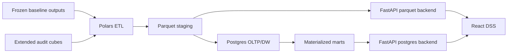

# Architecture

## OLTP

The `oltp` schema models research operations, not trading operations:

- research runs
- data snapshots
- artifact inventory
- candidate grids
- simulation jobs and statuses
- cube builds
- DSS query logs
- audit cases
- what-if requests

It exists to show operational lineage for the laboratory and DSS.

The ETL writes OLTP Parquet tables under `outputs/parquet/oltp/` and the Postgres loader copies at least `research_run`, `data_snapshot`, `artifact_inventory`, and `candidate_grid` before DW dimensions and facts. Missing OLTP Parquet files are reported as 0-row skipped loads rather than hard failures.

## DW

The `dw` schema separates dimensions and facts. Facts are intentionally aligned with Mahoraga research questions: decisions, positions, modules, outcomes, robustness, what-if scenarios, universe stress, costs, and drawdown paths.

## Marts

The `mart` schema contains materialized views optimized for the API:

- `mv_scorecard_candidate`
- `mv_performance_by_fold`
- `mv_robustness_surface`
- `mv_decision_outcome`
- `mv_module_effectiveness`
- `mv_ticker_contribution`
- `mv_regime_behavior`
- `mv_whatif_grid`
- `mv_drawdown_replay`
- `mv_decision_replay`
- `mv_query_performance`

Materialized views are created after base tables and refreshed after data loads. `mart.mv_query_performance` is the historical/materialized summary; the API endpoint `/query/performance` also reads recent aggregates directly from `oltp.dss_query_log` so it can show fresh request logs before the next refresh.

## Nullable Scope Fields

Some facts intentionally combine metrics from different scopes. For `dw.fact_candidate_metric` and `dw.fact_robustness_surface`, `sweep_role` is nullable when the metric set does not have an applicable sweep role, for example universe robustness rows. Uniqueness for `fact_candidate_metric` uses `COALESCE(sweep_role, '__not_applicable__')` rather than a primary key on a nullable column.

## Partitioning And Indexes

Partitioned facts:

- `fact_market_bar`: range partitioned by date.
- `fact_position_daily`: range partitioned by date.
- `fact_outcome`: list partitioned by horizon.
- `fact_module_trace`: list partitioned by module.

Indexes target DSS filters:

- candidate + fold + date
- candidate + horizon + decision date
- asset + date
- module + candidate + fold + date
- regime + candidate + fold
- BRIN temporal indexes for large date-ordered facts

`sql/010_sample_queries.sql` includes `EXPLAIN (ANALYZE, BUFFERS)` examples for the main marts.

## Stack

- Python for orchestration and API.
- Polars for ETL transforms.
- Parquet for local staging and Windows dev mode.
- Postgres for final OLTP/DW/mart execution.
- FastAPI for validated DSS endpoints.
- React/Vite/Recharts for interactive UI.

## Scalability And Operations Layer

The current batch pipeline remains the default contract. A new control-plane
layer adds source manifests, adaptive planning, stage logs, data contracts,
partition manifests, dependency-based mart refresh, cache invalidation logs,
publish logs, pending outcomes, and query/load benchmarks without changing the
existing OLTP/DW/mart names consumed by the API.

Adaptive path:

```mermaid
flowchart LR
  A["Baseline / extended artifacts"] --> B["source manifest + hashing"]
  B --> C["adaptive planner"]
  C --> D["execution plan"]
  D --> E["Polars staging"]
  E --> F["table Parquet + optional partitioned Parquet"]
  F --> G["data contracts"]
  G --> H["Postgres full or partition refresh"]
  H --> I["dependent mart refresh"]
  I --> J["publish log + cache invalidation log"]
  J --> K["unchanged FastAPI endpoints"]
```

The design scales to millions of rows by avoiding unnecessary full reloads,
processing supported logical partitions, refreshing only dependent marts, and
keeping the frontend on hot read models. It does not claim live trading or
large-user production capacity.
