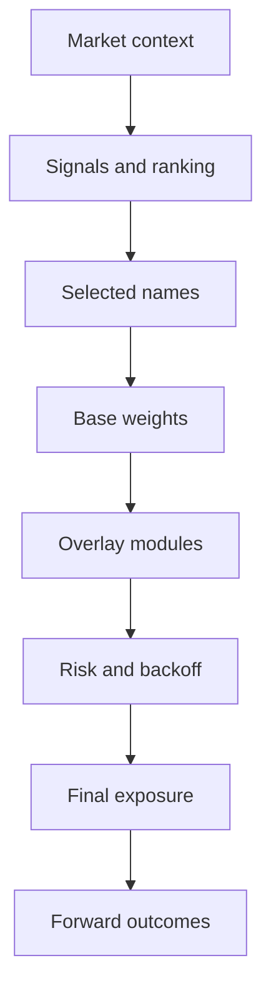
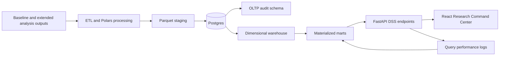

# Mahoraga Quant Research Command Center

Mahoraga Quant Research Command Center is a Postgres-backed Decision Support
System for the frozen Mahoraga 14.3R research baseline and its extended audit
artifacts. It converts backtest outputs, decision traces, robustness sweeps,
what-if scenarios, module diagnostics, ticker contribution, regime behavior,
and query telemetry into a queryable analytical system.

This layer does not modify `baseline/mahoraga14_3_baseline`, recalibrate the
model, alter official results, or treat simulated what-if rows as observed
evidence. It is a research, validation, auditability, and decision intelligence
system. It is not a live trading system and is not broker-integrated.

## 1. Executive Summary

Mahoraga is a quantitative research framework that evaluates a frozen allocation
policy across validation folds, horizons, modules, regimes, assets, robustness
sweeps, and replayable decision states. The official baseline represented in
this DSS is Mahoraga 14.3R `ROBUST_MAIN`.

The DSS adds an analytical data architecture around the frozen research outputs:

- OLTP audit tables for runs, snapshots, artifacts, candidate grids, and query
  logs.
- A dimensional warehouse with dates, assets, candidates, folds, horizons,
  modules, regimes, scenarios, and metrics.
- Fact tables for market bars, signals, decisions, positions, module traces,
  outcomes, candidate metrics, robustness, cost sensitivity, what-if scenarios,
  path recursion, and data quality.
- Materialized marts for fast screen-level research questions.
- FastAPI endpoints over Postgres.
- A React research frontend with lazy-loaded views, client-side cache, and
  abortable requests.

The implemented run currently contains `496,967` logical rows, including
`494,467` real rows and `2,500` flagged simulated what-if rows. The frontend
does not load raw 400k+ fact rows. It requests summarized distributions,
percentiles, cohorts, ranking tables, and paginated drill-through records from
Postgres-backed endpoints and marts.

## 2. Official Baseline

The official baseline is the frozen Mahoraga 14.3R `ROBUST_MAIN` candidate:

| Field | Value |
| --- | ---: |
| Candidate ID | `B1.05_C1.10_L1.10_R1.05` |
| Universe | `base_universe_12` |
| CAGR | `32.55%` |
| Sharpe | `1.483` |
| Sortino | `2.528` |
| Max drawdown | `-16.20%` |
| Newey-West alpha vs QQQ | `21.47%` |
| Newey-West alpha vs SPY | `25.05%` |
| Average exposure | `65.34%` |
| Average turnover | `4.97%` |
| Robust region flag | `true` |

Benchmark comparison from the official baseline artifact:

| Series | CAGR | Sharpe | Sortino | MaxDD | Avg exposure |
| --- | ---: | ---: | ---: | ---: | ---: |
| Mahoraga 14.3R `ROBUST_MAIN` | `32.55%` | `1.483` | `2.528` | `-16.20%` | `65.34%` |
| QQQ | `20.14%` | `0.918` | `1.456` | `-35.24%` | `100.00%` |
| SPY | `14.88%` | `0.846` | `1.309` | `-33.72%` | `100.00%` |

The official path improves CAGR over QQQ by `+12.41` percentage points and
reduces maximum drawdown by `19.04` percentage points. Relative to SPY, it
improves CAGR by `+17.67` percentage points and reduces maximum drawdown by
`17.52` percentage points. These are audited baseline comparisons, not what-if
simulation outputs.

## 3. Quant Results Addendum

### 3.1 Economic Performance

The official baseline combines a higher annualized return profile than QQQ/SPY
with materially lower maximum drawdown in the frozen comparison artifact. Its
average exposure is below fully invested benchmark exposure, so the observed
edge is not simply a result of remaining at full market beta throughout the
period. The Newey-West alpha fields are positive versus both QQQ and SPY in the
official artifact, with annualized alpha of `21.47%` versus QQQ and `25.05%`
versus SPY.

The research interpretation is that Mahoraga 14.3R produces a favorable
return/drawdown trade-off in the audited path while keeping exposure and
turnover visible as governance metrics. The DSS keeps these fields separate
from simulated stress rows so official baseline evidence is not blended with
scenario exploration.

### 3.2 Fold-Level Evidence

Fold-level evidence shows that the official edge is not uniform across
validation windows:

| Fold | Avg realized return | Avg alpha vs QQQ | Avg alpha vs SPY | Avg exposure | Helped rate | Observations |
| --- | ---: | ---: | ---: | ---: | ---: | ---: |
| 1 | `0.48%` | `-0.04%` | `0.17%` | `63.88%` | `47.94%` | `1,506` |
| 2 | `1.40%` | `0.09%` | `0.58%` | `71.37%` | `54.06%` | `1,515` |
| 3 | `0.53%` | `0.66%` | `0.36%` | `57.03%` | `55.73%` | `1,509` |
| 4 | `2.63%` | `1.24%` | `1.75%` | `82.18%` | `59.89%` | `1,122` |
| 5 | `0.47%` | `-0.06%` | `-0.06%` | `54.26%` | `48.18%` | `1,233` |

Fold 4 provides the strongest positive evidence in the current DSS slice, while
folds 1 and 5 are weaker. This does not invalidate the official result; it
shows why fold-level audit is a necessary governance layer. The model's edge is
observable, but it is distributed unevenly across time slices.

### 3.3 Robustness and Sensitivity

The extended multiplier audit shows that the budget multiplier is the dominant
local sensitivity axis:

| Axis | Sensitivity score | Worst candidate | Worst Sharpe drop | Worst CAGR drop | Severe fold damage |
| --- | ---: | --- | ---: | ---: | ---: |
| Budget multiplier | `5.567` | `B0.90_C1.10_L1.10_R1.05` | `0.190` | `0.294` | `5` |
| Leader multiplier | `0.178` | `B1.05_C1.10_L0.90_R1.05` | `0.050` | `0.053` | `0` |
| Backoff strength | `0.150` | `B1.05_C1.10_L1.10_R0.90` | `0.040` | `0.052` | `0` |
| Conviction multiplier | `0.076` | `B1.05_C1.30_L1.10_R1.05` | `0.027` | `0.005` | `0` |

The sensitivity tornado therefore identifies allocation intensity as the main
driver of observed local variation. Conviction, leader, and backoff multipliers
still matter, but their local impact is materially smaller in the audited sweep.

Plateau radius evidence also separates axes:

| Axis | Official value | Robust minimum | Robust maximum | Relative radius |
| --- | ---: | ---: | ---: | ---: |
| Budget multiplier | `1.05` | `1.05` | `1.15` | `0.000` |
| Conviction multiplier | `1.10` | `0.90` | `1.30` | `0.182` |
| Leader multiplier | `1.10` | `0.90` | `1.30` | `0.182` |
| Backoff strength | `1.05` | `0.90` | `1.20` | `0.143` |

The official candidate is in a robust region, but the budget axis has no
lower-side plateau at the official value in the sampled neighborhood. That is
the main reason the DSS treats sensitivity as a first-class audit screen rather
than a cosmetic chart.

The best observed stress label in the available what-if reference payload is
`EXTREME_all-high`, with `39.72%` CAGR, `1.696` Sharpe, and `-15.44%` MaxDD.
This observed sweep result is not automatically promoted over the official
baseline because the official baseline remains the frozen governance reference.

### 3.4 What-if and Stress Testing

What-if and Stress separates four concepts:

- Official baseline reference: the frozen, audited Mahoraga 14.3R candidate.
- Observed sweep scenarios: real extended robustness rows where available.
- Simulated what-if scenarios: flagged rows with `demo_mode=true`.
- Applied scenario: the user's confirmed scenario in the frontend session.

The scenario builder lets the user vary budget, conviction, leader, backoff,
cost, slippage, fold, and horizon. Selector options are constrained to valid
scenarios for the active fold/horizon slice. Draft controls produce an immediate
nearest-scenario preview with distance, CAGR, Sharpe, MaxDD, and deltas versus
official and applied references. Applying a scenario updates the applied marker,
ranking row, Pareto highlight, and scenario delta cards.

Simulated what-if rows are useful for interaction design and scenario
exploration, but they are not documented as official performance. For example,
the current simulated best scenario in the queried fold/horizon/cost/slippage
slice is labeled as `demo_synthetic_whatif_grid` and carries `demo_mode=true`.

### 3.5 Module Attribution

Module attribution links decision overlays to forward outcome evidence. The
DSS uses `fact_module_trace` and `mart.mv_module_effectiveness` to summarize
activation rate, helped rate, average alpha, and observations by module,
horizon, and fold.

The current evidence shows `BASE_ALPHA_V2` as the always-on base signal layer in
the displayed module slices. The module matrix is useful because it does not ask
only whether a module is present; it asks whether activation coincides with
better forward outcomes at each horizon. This is how the DSS separates a
frequently active module from a module that improves the measured outcome.

Other module families represented in the frontend include continuation, risk
backoff, participation allocation, leader blend, conviction amplification, and
structural defense behavior where present in the trace payloads. The DSS keeps
module evidence tied to row counts and horizons to avoid over-interpreting
sparse module slices.

### 3.6 Ticker Contribution

Ticker contribution analysis indicates that the official path is not purely
index-like. Positive contribution is concentrated in a subset of names, while
drag analysis identifies assets that penalized selected allocation.

Top positive contributors in the current official slice include:

| Ticker | Total PnL contribution | Avg weight | Selection rate | Leader rate | Observations |
| --- | ---: | ---: | ---: | ---: | ---: |
| NVDA | `0.653` | `10.67%` | `84.74%` | `84.74%` | `2,295` |
| NFLX | `0.477` | `10.24%` | `83.79%` | `83.79%` | `2,295` |
| META | `0.459` | `7.76%` | `85.17%` | `85.17%` | `2,295` |
| AVGO | `0.384` | `12.10%` | `87.15%` | `87.15%` | `2,295` |
| AAPL | `0.335` | `8.95%` | `89.98%` | `89.98%` | `2,295` |

The screen aggregates by ticker when `fold=all` so labels are not duplicated.
When fold-level detail is shown, the table explicitly includes the fold
dimension. This keeps contribution analysis interpretable at both roll-up and
drill-down levels.

### 3.7 Regime Analysis

Regime analysis explains how behavior changes by market/participation state:

| Regime | Avg net return | Avg benchmark return | Avg exposure | Avg drawdown | Backoff activation | Observations |
| --- | ---: | ---: | ---: | ---: | ---: | ---: |
| `BULL_PARTICIPATION` | `0.195%` | `0.160%` | `79.86%` | `-2.45%` | `100.00%` | `924` |
| `HARD_BACKOFF` | `-0.008%` | `-0.058%` | `20.46%` | `-12.12%` | `100.00%` | `432` |
| `NEUTRAL` | `0.113%` | `0.038%` | `83.81%` | `-5.88%` | `100.00%` | `364` |
| `LEADER_BULL_PARTICIPATION` | `0.111%` | `0.083%` | `77.92%` | `-4.38%` | `100.00%` | `303` |
| `BACKOFF` | `0.185%` | `0.281%` | `58.35%` | `-10.66%` | `100.00%` | `259` |
| `HIGH_PARTICIPATION` | `0.237%` | `0.231%` | `100.55%` | `-0.13%` | `100.00%` | `13` |

The current DSS evidence suggests that high-participation and bull-participation
states carry stronger average net returns, while hard backoff materially reduces
exposure in weaker states. The `HIGH_PARTICIPATION` slice is small, so its
summary should be read as descriptive evidence rather than a broad statistical
claim.

### 3.8 Decision Replay Findings

Decision Replay audits one decision from market context through outcome:



The replay endpoint reconstructs a decision using `fact_decision_state`,
`fact_position_daily`, `fact_module_trace`, `fact_outcome`, and market bars. The
casebook is designed to load rich examples rather than placeholders, including:

- Best 20-day outcome.
- Worst 20-day outcome.
- Backoff with missed upside.
- Backoff with positive outcome.
- High exposure decision.
- Concentrated allocation.
- Largest ticker drag.
- Strongest leader participation.

The value of replay is auditability: an aggregate metric can be traced back to
the exact fold, date, selected names, final weights, module trace, risk/backoff
state, and forward outcome rows that produced it.

### 3.9 Distributions and Cohorts

The DSS includes summarized distributions and cohort tables so analysis does
not depend only on averages.

Outcome percentiles by horizon:

| Horizon | Observations | Average outcome | Median | P5 | P95 | Helped rate | Avg alpha vs QQQ |
| --- | ---: | ---: | ---: | ---: | ---: | ---: | ---: |
| 1 | `2,295` | `0.12%` | `0.00%` | `-1.91%` | `2.17%` | `50.68%` | `0.04%` |
| 5 | `2,295` | `0.60%` | `0.22%` | `-3.80%` | `5.49%` | `52.42%` | `0.19%` |
| 20 | `2,295` | `2.40%` | `1.06%` | `-5.71%` | `12.29%` | `55.86%` | `0.81%` |

Decision-state distributions:

| Metric | Observations | Average | P5 | Median | P95 |
| --- | ---: | ---: | ---: | ---: | ---: |
| Exposure | `2,295` | `65.34%` | `0.00%` | `91.54%` | `97.19%` |
| Turnover | `2,295` | `4.97%` | `0.00%` | `0.08%` | `34.10%` |
| Drawdown | `2,295` | `-6.60%` | `-27.80%` | `-2.80%` | `0.00%` |

Exposure cohorts show a clear risk/reward split:

| Cohort | Observations | Avg outcome | Median outcome | P5 | P95 | Helped rate | Avg alpha vs QQQ | Avg exposure |
| --- | ---: | ---: | ---: | ---: | ---: | ---: | ---: | ---: |
| Low exposure | `819` | `1.29%` | `0.00%` | `-2.87%` | `9.32%` | `44.44%` | `-0.61%` | `19.29%` |
| Mid exposure | `164` | `2.97%` | `2.24%` | `-5.04%` | `10.70%` | `57.32%` | `1.24%` | `69.55%` |
| High exposure | `1,312` | `3.02%` | `3.19%` | `-6.66%` | `13.98%` | `62.80%` | `1.64%` | `93.57%` |

The current evidence suggests that higher exposure improves median and average
20-day outcomes in the audited slice, but also widens the left-tail P5 outcome.
That is exactly the type of trade-off the cohort layer is meant to expose:
stronger upside evidence is visible, but it carries a broader downside tail.

Leader and turnover cohorts add further behavior checks:

- High leader blend has slightly higher average outcome (`1.09%` vs `0.99%`)
  and helped rate (`53.89%` vs `52.18%`) than low leader blend in the current
  cohort payload.
- High turnover has slightly higher average outcome (`1.12%` vs `1.02%`) and
  helped rate (`53.52%` vs `52.85%`) than low turnover in the current slice.

These statements are descriptive for the current DSS evidence; they are not
guarantees of future live performance.

## 4. DSS Screens and Research Questions

| Screen | Purpose | Core questions answered | Main data sources | OLAP operations |
| --- | --- | --- | --- | --- |
| Command Center | Executive research summary for the frozen official baseline | What is the official baseline? What is the benchmark edge? What is the main sensitivity driver? Is the data engine healthy? | `/research/command-center`, scorecard mart, extended robustness artifacts, health summary | Roll-up, comparison, summary |
| Baseline Evidence | Formal statistical and operating evidence | Is alpha positive vs QQQ/SPY? How do cost/slippage and folds affect evidence? Are outcomes stable by horizon? | Official comparison CSV, fold summary, `/research/distributions` | Slice, roll-up, percentile analysis |
| Robustness Lab | Multiplier robustness and sensitivity audit | Which axis degrades performance most? Is the official point robust? Which candidates are best/worst? | `fact_robustness_surface`, extended multiplier CSVs, robustness mart | Slice, dice, sensitivity, Pareto analysis |
| What-if & Stress | Scenario exploration with observed/simulated separation | What changes under valid multiplier/cost/slippage scenarios? How does preview differ from applied and official? | `/whatif/grid`, `/research/whatif-reference`, `fact_whatif` | What-if, nearest scenario, comparison |
| Decision Replay | Single-decision audit | Why did the model allocate on this date? Which tickers, modules, and outcomes explain it? | `fact_decision_state`, `fact_position_daily`, `fact_module_trace`, `fact_outcome`, `mart.mv_decision_replay` | Drill-through, replay |
| Module Attribution | Module-level contribution diagnostics | Which modules activate? Which modules help by horizon? Which are high activity but low evidence? | `mart.mv_module_effectiveness`, `fact_module_trace`, `fact_outcome` | Pivot, slice, roll-up |
| Ticker Contribution | Asset-level contribution and drag | Which tickers contributed most? Which tickers dragged? Is contribution concentrated? | `mart.mv_ticker_contribution`, position/outcome facts | Roll-up, drill-down, drill-through |
| Regime Analysis | Behavior by market/participation state | Which regimes carry alpha proxy? Where is exposure concentrated? Where does backoff matter? | `mart.mv_regime_behavior`, decision facts | Roll-up, slice, cohort analysis |
| OLAP Explorer | Mining Questions Workbench | Which analytical questions are supported by the DSS cube? What is the result table and next drill-through action? | `/research/olap-preset`, distributions, cohorts, marts | Slice, dice, roll-up, drill-down, pivot, drill-through |
| Data Engineering | Evidence that the DSS is real data infrastructure | How many rows are loaded? Which marts support views? Which endpoints are slow? Which sources are queried? | `/data/health-summary`, `/data/execution-evidence`, query log mart | Observability, monitoring, lineage |

## 5. OLAP and Mining Questions

The Mining Questions Workbench exposes prebuilt analytical questions rather
than generic charts. Each preset includes a question, operation type, filters,
result table, chart when useful, interpretation, and a real next action when the
frontend can navigate to supporting evidence.

Question families include:

| Family | Example questions | Analytical value |
| --- | --- | --- |
| Performance | Is Sharpe stable across folds? Which fold contributes most to official performance? Which fold carries the worst drawdown? | Audits whether edge is broad or concentrated in a validation slice. |
| Robustness | Which candidate has the best CAGR/MaxDD trade-off? Which multiplier axis degrades performance? Which candidate has severe fold damage? | Separates strong point estimates from robust neighborhoods. |
| Modules | Which module helps most by horizon? Which module activates often but adds little? Which module coincides with better outcomes? | Connects decision overlays to observed outcome evidence. |
| Tickers | Which tickers contribute most? Which tickers drag most? Which tickers are frequent leaders? | Tests whether performance is diversified or concentrated in a small set of assets. |
| Regimes | Which regime has best alpha proxy? Where is exposure concentrated? Where does backoff activate most? | Explains when the model takes risk and when it defends. |
| Decisions | Best decisions by 20-day outcome. Worst decisions by 20-day outcome. High exposure with bad outcome. Backoff with missed upside. | Turns aggregate metrics into auditable individual decisions. |
| Distributions | Outcome percentiles by horizon. Exposure buckets vs outcome. Turnover buckets vs outcome. Drawdown distribution by regime/fold. | Tests whether averages depend on extreme outliers or broad distributional support. |
| Data engineering | Which endpoint is slowest by average latency? Which endpoint has highest p95? Which source relation is used most? | Keeps query performance and data lineage visible inside the DSS. |

The workbench supports the classical OLAP operations in a research-specific
form:

- Slice: restrict to a fold, horizon, ticker, regime, module, or scenario.
- Dice: combine filters such as fold plus horizon plus ticker.
- Roll-up: aggregate from decision/ticker/fold detail to official totals.
- Drill-down: move from an aggregate metric to constituent rows.
- Pivot: rotate module x horizon, fold x metric, or regime x measure layouts.
- Drill-through: open a replay, ticker, regime, robustness, or data engineering
  view when the row supports a real action.
- What-if: compare official, preview, applied, observed, and simulated scenario
  states without blending their evidence classes.

## 6. Data Architecture



The DSS is implemented as a layered analytical system:

1. Baseline and extended-analysis artifacts remain frozen inputs.
2. ETL reads artifacts and writes Parquet staging.
3. Postgres stores OLTP audit records and dimensional warehouse tables.
4. Materialized marts pre-aggregate common research views.
5. FastAPI exposes summarized endpoints.
6. React renders lazy-loaded research views.
7. Query logs feed the Data Engineering screen and performance marts.

The architecture uses Postgres as the primary analytical backend. Parquet mode
exists for development and portability, but the validated DSS path is Postgres.

## 7. Data Model

Implemented row counts from the latest validated run:

| Layer | Relation | Rows |
| --- | --- | ---: |
| OLTP | `research_run` | `1` |
| OLTP | `data_snapshot` | `1` |
| OLTP | `artifact_inventory` | `16` |
| OLTP | `candidate_grid` | `57` |
| Dimension | `dim_date` | `2,295` |
| Dimension | `dim_asset` | `52` |
| Dimension | `dim_candidate` | `42` |
| Dimension | `dim_universe` | `5` |
| Dimension | `dim_fold` | `5` |
| Dimension | `dim_module` | `7` |
| Dimension | `dim_regime` | `6` |
| Dimension | `dim_horizon` | `4` |
| Dimension | `dim_scenario` | `2,542` |
| Dimension | `dim_metric` | `9` |
| Fact | `fact_market_bar` | `4,590` |
| Fact | `fact_signal_daily` | `165,240` |
| Fact | `fact_decision_state` | `13,770` |
| Fact | `fact_position_daily` | `165,240` |
| Fact | `fact_module_trace` | `96,390` |
| Fact | `fact_outcome` | `41,310` |
| Fact | `fact_candidate_metric` | `57` |
| Fact | `fact_robustness_surface` | `456` |
| Fact | `fact_cost_sensitivity` | `6` |
| Fact | `fact_universe_sensitivity` | `15` |
| Fact | `fact_whatif` | `2,542` |
| Fact | `fact_path_recursive` | `2,295` |
| Fact | `fact_data_quality` | `14` |

Materialized marts available in the current Postgres run:

- `mart.mv_decision_outcome`
- `mart.mv_decision_replay`
- `mart.mv_drawdown_replay`
- `mart.mv_module_effectiveness`
- `mart.mv_performance_by_fold`
- `mart.mv_query_performance`
- `mart.mv_regime_behavior`
- `mart.mv_robustness_surface`
- `mart.mv_scorecard_candidate`
- `mart.mv_ticker_contribution`
- `mart.mv_whatif_grid`

## 8. Scale and Performance

Current implemented scale:

| Metric | Value |
| --- | ---: |
| Total logical rows | `496,967` |
| Real rows | `494,467` |
| Simulated what-if rows | `2,500` |
| OLTP rows | `615` |
| DW rows | `496,892` |
| Mart rows | `89,173` |
| Materialized views | `11` |
| Endpoint groups in query log summary | `18` |

The standard pipeline records `expected_real_min_rows_for_profile=4,000,000`
and `real_row_target_met=false`. This is intentional documentation of current
implemented scale, not a failure hidden by the UI. The available real artifacts
produce roughly 494k real rows, and the architecture is designed to scale when
more real candidates, universes, folds, module traces, horizons, and outcomes
are loaded.

Query performance evidence from the current execution payload:

| Metric | Endpoint | Avg latency | P95 latency | Query count | Source relation |
| --- | --- | ---: | ---: | ---: | --- |
| Slowest average endpoint | `/research/decision-casebook` | `522.68 ms` | `839.64 ms` | `23` | `dw.fact_decision_state+dw.fact_outcome` |
| Highest p95 endpoint | `/decision/replay` | `433.47 ms` | `2232.28 ms` | `84` | `fact_decision_state+fact_position_daily+fact_module_trace+fact_outcome` |
| Most queried endpoint | `/whatif/grid` | `13.20 ms` | `26.05 ms` | `105` | `fact_whatif` |
| Most used source relation | `fact_whatif` | `13.20 ms` | `26.05 ms` | `105` | `fact_whatif` |

`/decision/replay` remains the main p95 optimization target because it joins
decision state, positions, module trace, and outcomes. Replay lookup indexes are
defined in `sql/006_create_indexes.sql` using idempotent `CREATE INDEX IF NOT
EXISTS` statements for candidate, universe, fold, date, ticker, module, and
outcome lookup patterns. These indexes do not change official results.

Implemented scalability mechanisms:

- Postgres-backed fact/dimension schema.
- Materialized marts for common DSS screens.
- Query logging for endpoint latency and source usage.
- Frontend lazy loading and cached API resources.
- AbortController support for view-level request cancellation.
- Summarized distributions/cohorts instead of raw fact dumps.
- Replay indexes for candidate/fold/date/ticker access paths.
- Parquet staging for reproducible batch loads.

Architectural scalability path:

- Partition large facts by date, fold, candidate, or horizon.
- Incremental mart refresh.
- API pagination for deeper drill-through.
- Read replicas for concurrent dashboard use.
- Scheduled materialized view refresh.
- Wider universes and larger candidate grids.
- CI validation for ETL, schema migrations, and smoke tests.
- Backtest registry and model governance metadata.

These are scalability paths, not claims that the current local research
deployment is a production multi-tenant trading platform.

## 9. API Surface

Validated endpoints with `DSS_BACKEND=postgres` include:

| Endpoint | Purpose |
| --- | --- |
| `/health` | Backend, profile, validation, row origin counts, and mart availability |
| `/data/health-summary` | Data engine summary for the frontend |
| `/data/execution-evidence` | Layer counts, source usage, query performance, optimization targets |
| `/metadata/options` | Candidate, fold, horizon, ticker, module, and regime options |
| `/labels/candidates` | Presentation-safe candidate labels |
| `/research/command-center` | Official baseline summary and research overview |
| `/research/baseline-evidence` | Statistical and operating baseline evidence |
| `/research/top-wins-drags` | Fold, ticker, module, and regime summaries |
| `/research/extended-summary` | Extended robustness and comparison artifacts |
| `/research/best-official-worst` | Best, official, and worst observed comparison |
| `/research/distributions` | Outcome, exposure, turnover, drawdown percentiles and buckets |
| `/research/cohorts` | Cohort analysis by exposure, leader, turnover, regime, fold, and horizon |
| `/research/whatif-reference` | Official, observed, and simulated what-if references |
| `/research/decision-casebook` | Rich replayable decision examples |
| `/research/olap-preset` | Mining Questions Workbench presets |
| `/overview` | High-level overview compatibility endpoint |
| `/scorecard` | Candidate scorecard |
| `/robustness/surface` | Robustness surface and candidate sweep rows |
| `/whatif/grid` | Scenario grid for What-if and Stress |
| `/decision/replay` | Decision-level replay and audit payload |
| `/slice` | Generic slice operation |
| `/drilldown` | Generic drill-down operation |
| `/module/effectiveness` | Module activation/helped evidence |
| `/ticker/contribution` | Ticker contribution and drag |
| `/regime/behavior` | Regime behavior summary |
| `/fold/performance` | Fold performance summary |
| `/candidate/compare` | Candidate comparison |
| `/query/performance` | Recent query performance log summary |

## 10. Validation and Reproducibility

Linux with local Postgres socket:

```bash
cd ~/QuantMahoraga/research/mahoraga14_3_dss_postgres
source .venv/bin/activate

export DSS_BACKEND=postgres
export DATABASE_URL="postgresql:///mahoraga_dss"

python -m etl.run_pipeline --mode parquet --profile standard
python -m etl.run_pipeline --mode postgres --profile standard --truncate
python -m etl.refresh_views
python -m etl.validate_outputs
python -m etl.validate_postgres
python -m scripts.smoke_postgres
```

API:

```bash
uvicorn api.main:app --reload --host 127.0.0.1 --port 8002
```

Frontend:

```bash
cd ~/QuantMahoraga/research/mahoraga14_3_dss_postgres/frontend
npm install
npm run build
VITE_API_BASE="http://127.0.0.1:8002" npm run dev
```

Default local frontend URL:

```text
http://127.0.0.1:5174
```

Windows without Postgres:

```powershell
cd D:\QuantMahoraga\research\mahoraga14_3_dss_postgres
python -m pip install -r requirements.txt
$env:DSS_BACKEND="parquet"
python -m etl.run_pipeline --mode parquet --profile small
uvicorn api.main:app --host 127.0.0.1 --port 8002
```

Docker Postgres:

```bash
docker compose -f docker-compose.postgres.yml up -d
export DSS_BACKEND=postgres
export DATABASE_URL="postgresql://<user>:<password>@127.0.0.1:5432/mahoraga_dss"
python -m etl.run_pipeline --mode postgres --profile standard --truncate
```

TCP Postgres without Docker:

```bash
export DSS_BACKEND=postgres
export DATABASE_URL="postgresql://<user>:<password>@127.0.0.1:5432/mahoraga_dss"
```

Do not commit real passwords. Keep credentials in the shell, a local untracked
`.env`, or a secret manager.

Vite 7 requires Node `20.19+` or `22.12+`. If the local Node is older, switch
with `nvm` before running `npm run build` or `npm run dev`.

## 11. Limitations

- This is a research DSS, not a live trading or broker execution system.
- Simulated what-if rows are flagged and must not be interpreted as official
  audited results.
- The current implemented scale is about 497k logical rows, not the full
  multi-million-row target profile.
- Some evidence is descriptive when a slice is small, such as sparse regimes or
  narrow module/fold intersections.
- Query performance is monitored inside the DSS; `/decision/replay` remains a
  p95 optimization target because it reconstructs rich decision context.
- The current deployment is local/research-scale, not a production multi-tenant
  cloud service.

## 12. Future Work

Potential extensions that preserve the current governance separation:

- Paper trading or live adapter outside the frozen research baseline.
- Incremental data refresh and scheduled materialized view refresh.
- Larger universe and broader candidate grid.
- Expanded transaction cost and slippage model.
- Extended risk model and regime diagnostics.
- Model monitoring and drift checks.
- CI/CD for ETL, schema migrations, API smoke tests, and frontend build.
- Cloud deployment with read replicas.
- Backtest registry with model lineage and approval metadata.
- Stronger model governance around candidate promotion and baseline freezes.

## 13. Related Files

- `ARCHITECTURE.md`: lower-level schema and pipeline overview.
- `DATA_CONTRACT.md`: API and payload contract notes.
- `RUNBOOK.md`: operational commands and troubleshooting.
- `sql/`: schema, marts, indexes, and materialized view definitions.
- `api/`: FastAPI application and Postgres-backed endpoint logic.
- `etl/`: Parquet/Postgres loading, validation, and refresh scripts.
- `frontend/src/views/`: Research Command Center views.
- `outputs/reports/pipeline_summary.json`: latest run counts and validation
  summary.
